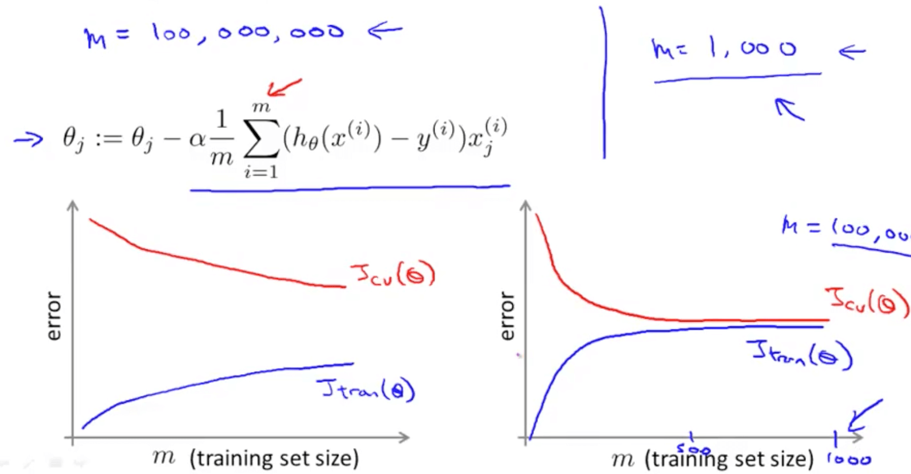
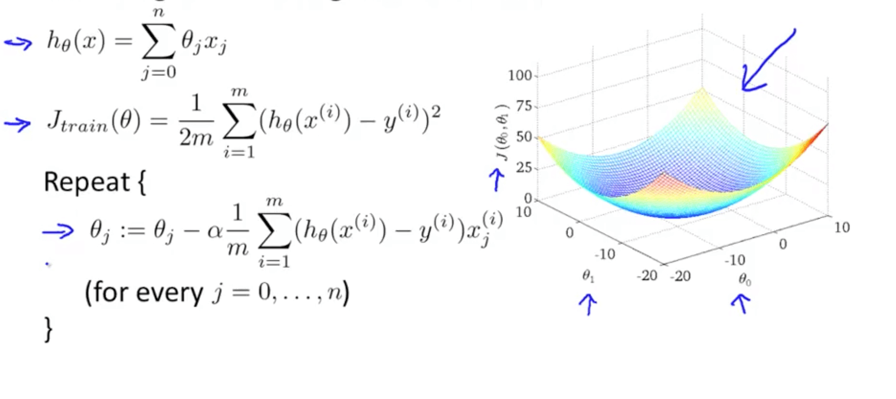
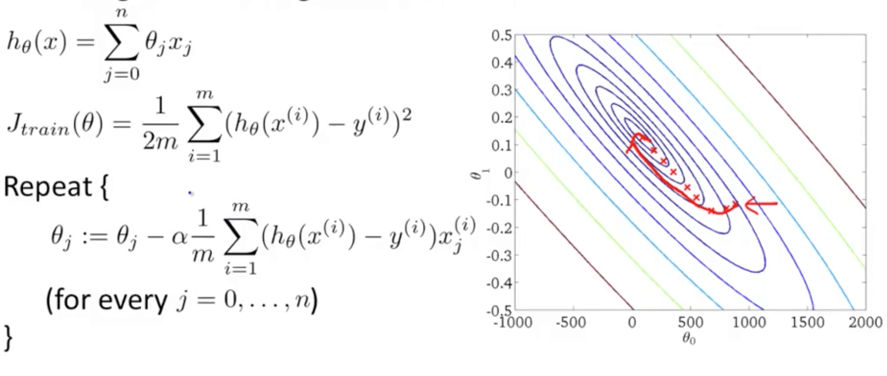
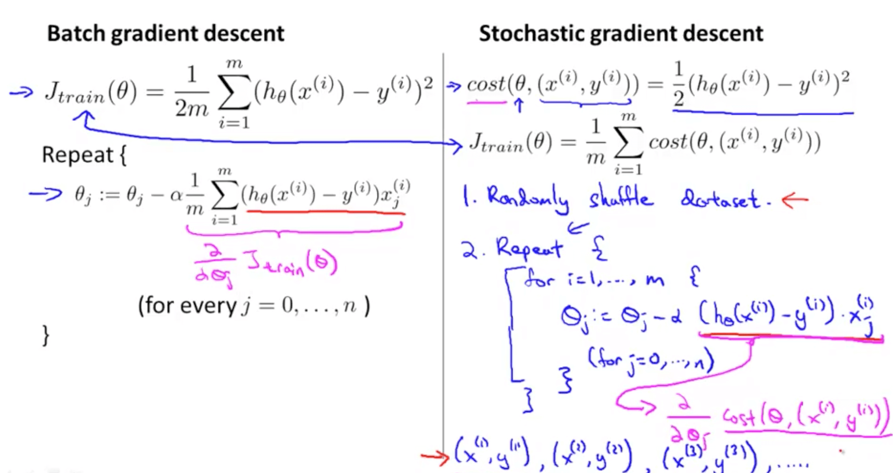
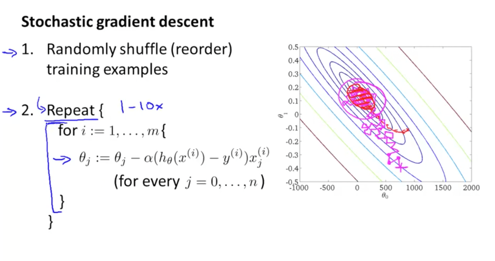
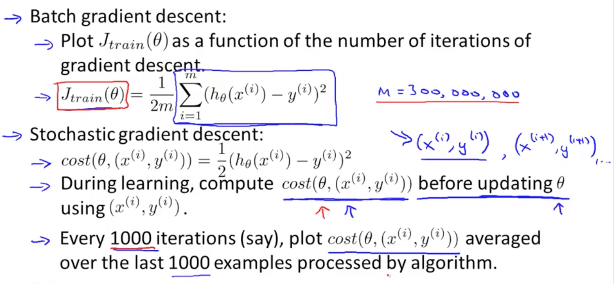
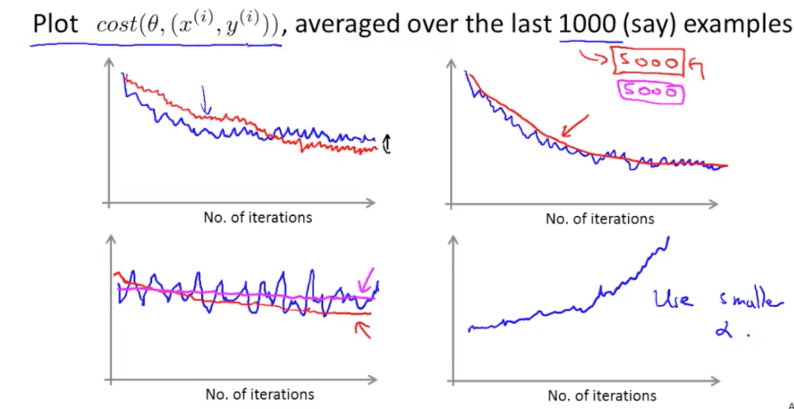
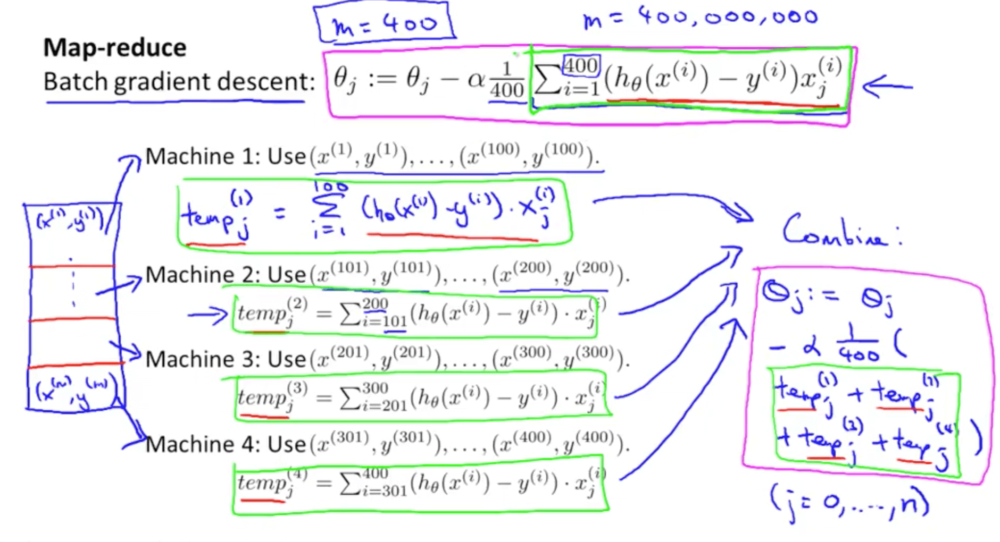
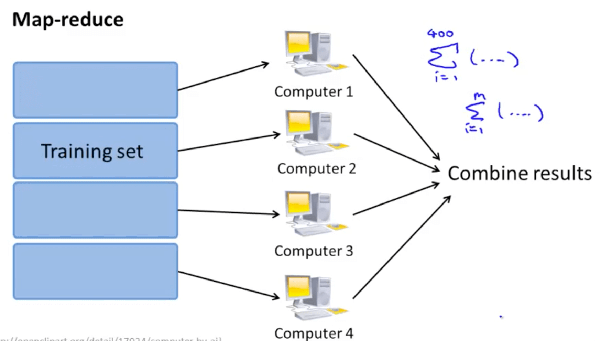

# Large Scale Machine Learning

## 1. Gradient Descent with Large Data Sets

### 1a. Learning with Large Data Sets
- Why do we want large data set?
    - This is evident when we take a low-bias learning algorithm and train it on a lot of data
        - The example of how "I ate two (two) eggs" shows how the algorithm performs well when we feed it a lot of data
        
- Learning with large data sets has computational problems
    - If m = 100m, we have to sum over 100m entries to compute one step of gradient descent
    - Suppose you are facing a supervised learning problem and have a very large data set (m = 100m), how can you tell if the data is likely to perform much better than using a small subset (m = 100) of the data?
        - Plot a learning curve for a range of values of m and verify that the algorithm has high variance when m is small
            - We would then be confident that adding more training examples would increase the accuracy
            - But if it's high bias, we do not need to plot to a large value of m
                - In this case, you can add extra features or units (in neural networks)
            

### 1b. Stochastic Gradient Descent
- Suppose we are training a linear regression model with gradient descent
    - If m is really large, we have to sum across all the examples
    - This is actually called batch gradient descent when you look at all the training examples
    
    
- We can use a stochastic gradient descent instead of a batch gradient descent
    - Stochastic gradient descent (more efficient)
        - Define cost of parameter θ with respect to x_i and y_i
            - This measures how well the hypothesis is doing on a single training example (x_i, y_i)
        - This algorithm will take the first training example and take a step (modify parameter) to fit the first example better until the end of the training set
        
        - Difference
            - Rather than waiting to take the parts of all the training examples (batch gradient descent), we look at a single training example and we are making progress towards moving to the global minimum
            - Batch gradient descent (red path)
            - Stochastic gradient descent (magenta path with a more random-looking path where it wonders around near the global minimum)
            - In practice, so long the parameters are near the global minimum, it's sufficient
            - We can repeat the loop maybe 1 to 10 times
            - It is possible even with 1 loop, where your m is large, you can have good parameters
            - Your J_train (cost function) may not decrease with every iteration for stochastic gradient descent
            

### 1c. Mini-Batch Gradient Descent
- This may some times be faster than stochastic gradient descent
- Difference
    - Batch gradient descent
        - Use all m examples in each iteration
    - Stochastic gradient descent
        - Use 1 example in each iteration
    - Mini-batch gradient descent
        - Use b examples in each iteration
        - b = mini-batch size
            - b = 10 examples
- Mini-batch gradient descent algorithm
    - After looking at the 10 training examples, we start making progress in modifying the parameters
    - Mini-batch gradient descent can outperform stochastic gradient descent if we use a vectorized implementation
    - This algorithm is the same as batch gradient descent if b = m, where we iterate across all training examples
    

### 1d. Stochastic Gradient Descent Convergence
- Checking for convergence
    - When you average over a smaller number of examples, there might be too much noise

- Stochastic gradient descent learning rate issue
    - Decrease learning rate to allow convergence for a slightly better hypothesis
    

## 2. Advanced Topics

### 2a. Online Learning
- What is online learning?
    - When we have a continuous stream of information and we want to learn from that
    - We can use an online learning algorithm to optimize some decisions
- Example of online learning: learning whether to buy or not buy
    - Shipping service website where user comes, specifies origin and destination, you offer to ship their package for some asking price, and users sometimes choose to use your shipping service (y = 1), sometimes not (y = 0)
    - Features x captures properties of user, of origin/destination and asking price
    - We want to learn p(y = 1 | x;θ) to optimize price
        - Probability of 1 given price and features
        - We can use logistic regression or neural network
    - Online learning algorithm
        - If you have a large number of users, you can do this
        - If you have a small number of users, you should save the data and train your parameters on your training data, not on a continuous stream of data
        - This online algorithm can adapt to users' preferences
        
- Example 2 of online learning: learning to search
    - User searches for "Android phone 1080p camera"
    - Have 100 phones in store with 10 results
    - x = features of phone, how many words in user query match name of phone, how many words in query match description of phone
    - y = 1 if user clicks on link
    - y = 0 if otherwise
    - We want to learn p(y = 1 | x;θ) to predict CTR
    - Use to show users' 10 phones they're most likely to click on
- Other examples
    - Choosing special offers to show user
    - Customized selection of news articles
    - Product recommendation     

### 2b. Map Reduce and Data Parallelism
- Map reduce and linear regression
    - This is an alternative to stochastic gradient descent and mini-batch gradient descent
    - It is exactly equal to batch gradient descent but 
        1. Split the training sets 
        2. Split to 4 computers
        3. Combine results
    - Many learning algorithms can be expressed as computing sums of functions over the training set
    
    
- Map reduce and logistic regression
    - This can be done too as we can compute sums of fractions
    
- Map reduce and neural network
    - Suppose you want to apply map-reduce to train a neural network on 10 machines
        - In each iteration, compute forward propagation and back propagation on 1/10 of the data to compute the derivative with respect to that 1/10 of the data
- Multi-core machines
    - We can split training sets to different cores and then combine the results
        - "Parallelizing" over multiple cores in the same machine makes network latency less of an issue
        - There are some libraries to automatically "parallelize" by just implementing the usual vectorized implementation
        

