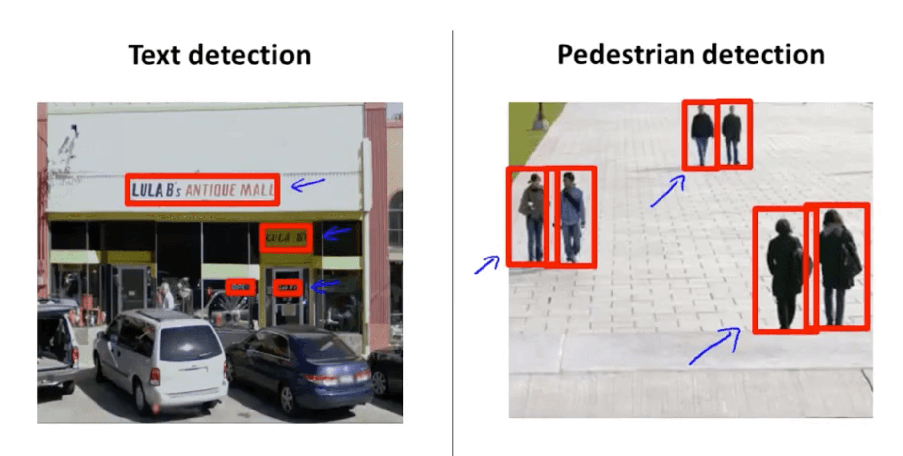
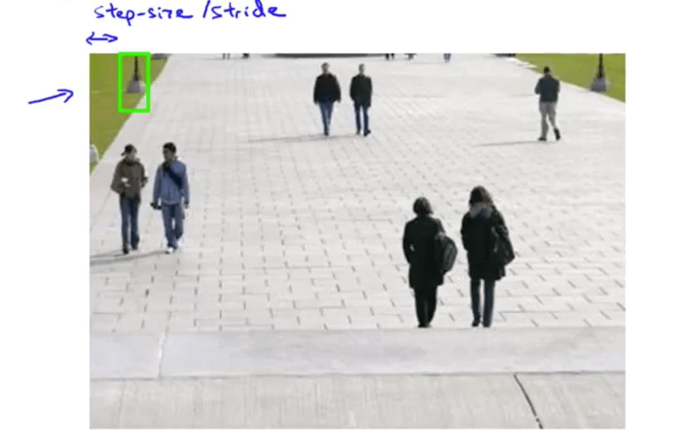
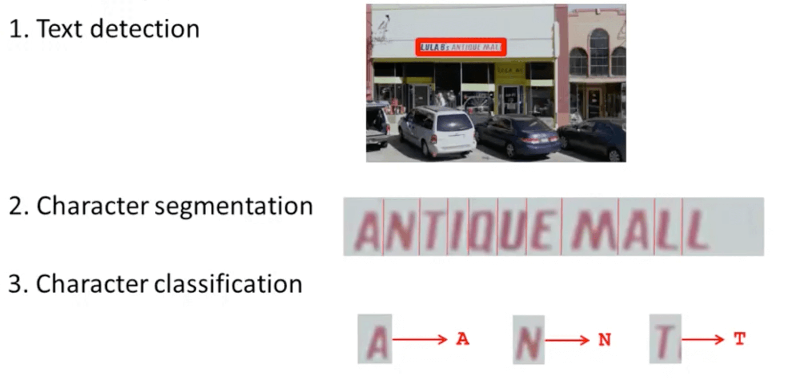
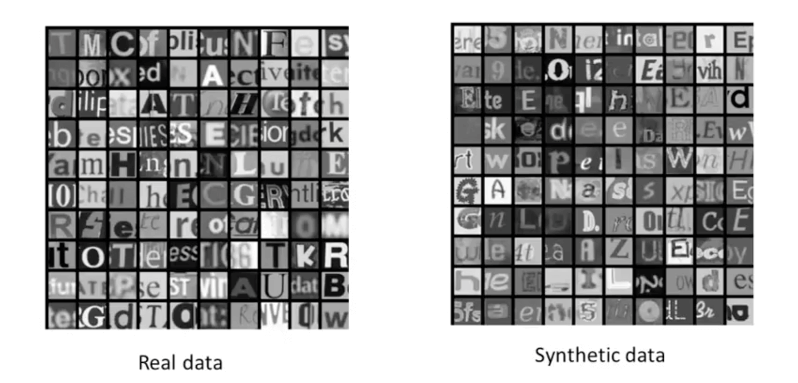
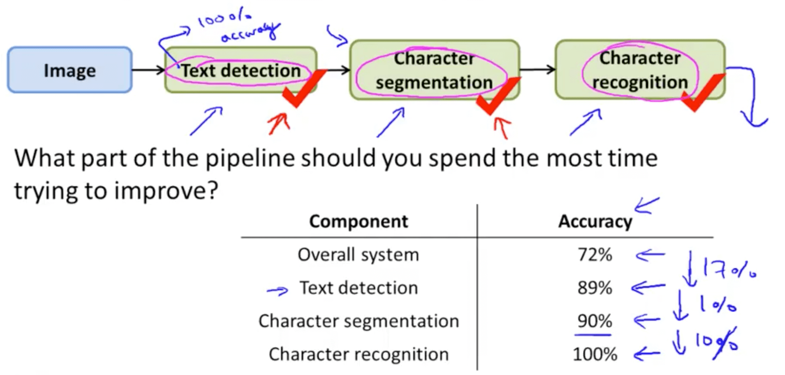
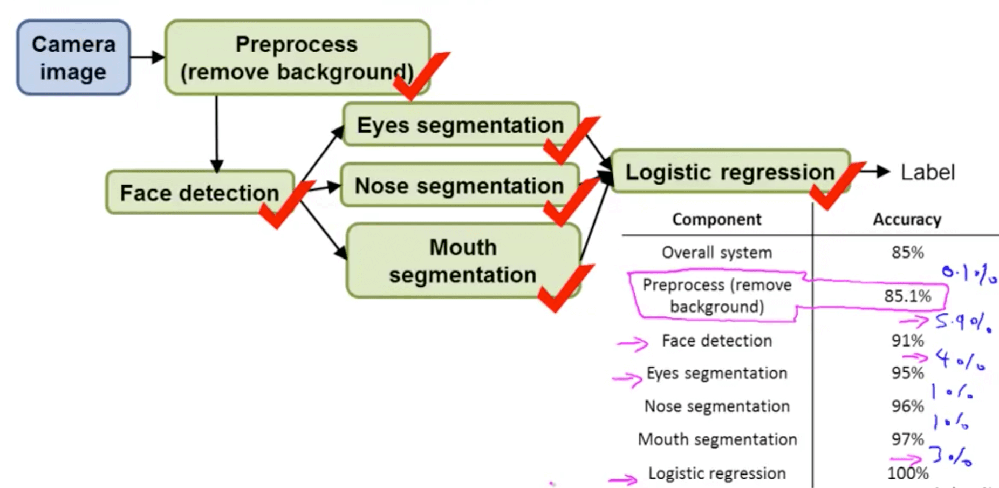

# Application Example: Photo OCR

## Photo OCR

### Problem Description and Pipeline
- Photo OCR (Optical Character Recognition) Problem
    1. Given picture, detect location of text in the picture
    2. Read text at that location
- Photo OCR Pipeline
    1. Text detection
    2. Character segmentation
        - Splitting "ADD" for example
    3. Character classification
        - First character "A", second "D", and so on
    
- When you design a machine learning algorithm, one of the most important steps is defining the pipeline    
    - A sequence of steps or components for the algorithms
    - Each step/module can be worked on by different groups to split the workload
    
### Sliding Windows
- In order to detect things in images we can use an example of pedestrian detection
    - We can identify the pedestrians easily because the aspect ratio of most pedestrians are similar
    
- Supervised learning for pedestrian detection
    - x = pixels in 82 x 36 image patches
    - We can train a neural network to classify image patch as either containing a pedestrian or not
    
- Sliding window detection
    - We slide a green box (82 x 36) with a defined step-size/stride
    - We continue sliding the window over the whole image
        - We can take a large box and resize to 82 x 36
        - That's how we train we train a supervised learning classifier to identify pedestrians
        
- Text detection
    - Positive examples (y = 1), patches with text
    - Negative examples (y = 0), patches without text
    - Let us run a sliding window classifier on the image
        - We have (on the bottom left) white areas that indicate text areas 
        - Bright white: classifier output a very high probability of text in the location
    - If we take one more text by taking the output of the classifier and apply an expansion operator
        - It takes the white region and expand them
        - If we use heuristics and discard those with abnormal height-to-width ratio
        
    - Now we have the text
        
        - We can start with the green rectangle and slide the window
            - Should we put a split in the window? 
            - Train a NN to recognize the text
- Photo OCR pipeline summary

### Getting Lots of Data and Artificial Data
- Artificial data synthesis
    - Creating data from scratch
    - If we have a small training set, we turn that into a large training set
- Example of artificial data synthesis for photo OCR: Method 1 (new data)
    - We can take free fonts, copy the alphabets and paste them on random backgrounds
    - As you can see, the image on the right are synthesized
    
- Example of artificial data synthesis for photo OCR: Method 2 (distortion)
    - We can distort existing examples to create new data
    - In this case, the way to distort is through warping the image
    
    
- Discussion on getting more data
    1. Make sure you have a low bias (high variance) classifier before expending the effort to get more data
        - Plot the learning curves to find out
        - Keep increasing the number of features or number of hidden units in the neural network until you have a low bias classifier
    2. How much work would it be to get 10x as much data as you currently have
        - Artificial data synthesis
        - Collect/label it yourself
        - Crowd course 
            - Hire people on the web to label data (amazon mechanical turk)
            
### Ceiling Analysis: What Part of the Pipeline to Work on Next
- Ceiling analysis
    - When you have a team working on a pipeline machine learning system
        - This gives you an indication on which part of the pipeline is worth working on
- Ceiling analysis definition
    - Estimating the errors due to each component
- Photo OCR example
    - Choose any metric you would like
        - Overall system
        - Text detection
    - By putting a check mark on "text detection"
        - Going to go to the test set and give it the correct answers
        - It's as if you have a perfect text detection system
        - Check the accuracy of the whole system (72% to 89%: 17% improvement)
        - You run the algorithm and go to the next component in the pipeline
            - You give it the correct "character segmentation"
            - Check accuracy of the whole system (89% to 90%: 1% only)
        - You run the algorithm mon the last component in the pipeline
            - Check accuracy of the whole system (90% to 100%: 10%)
    - This shows the upside potential from each component 

- Another ceiling analysis example: face recognition from images
    - Components most worthwhile
        - Perfect face detection (5.9%)
        - Perfect eye segmentation (4%)

- Do not use your gut feeling
    - Use ceiling analysis
