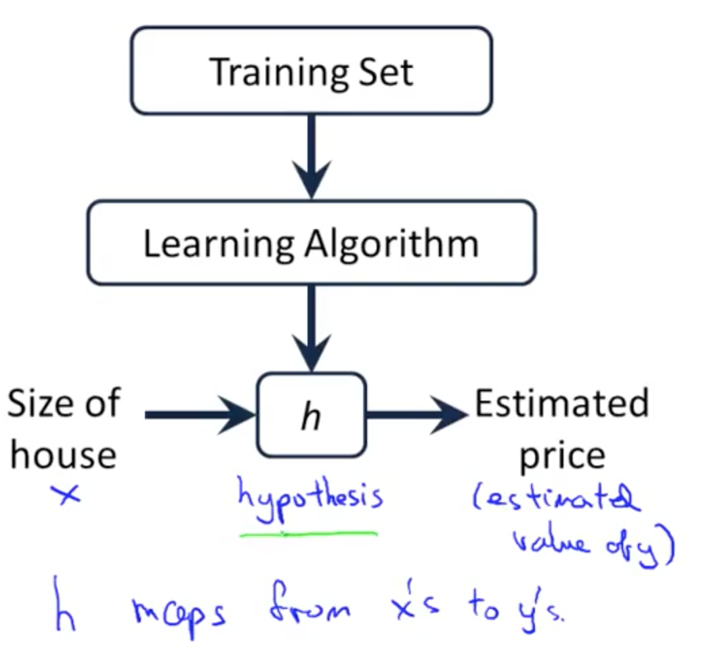
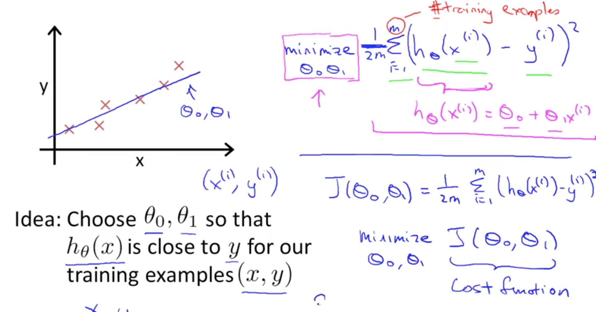
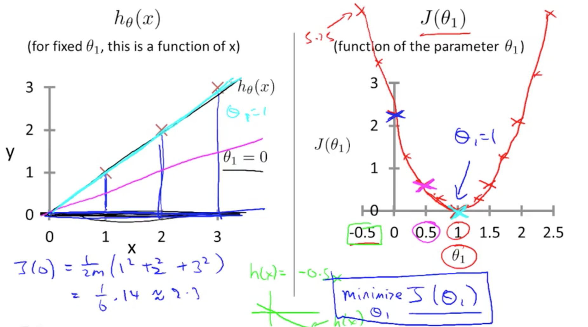
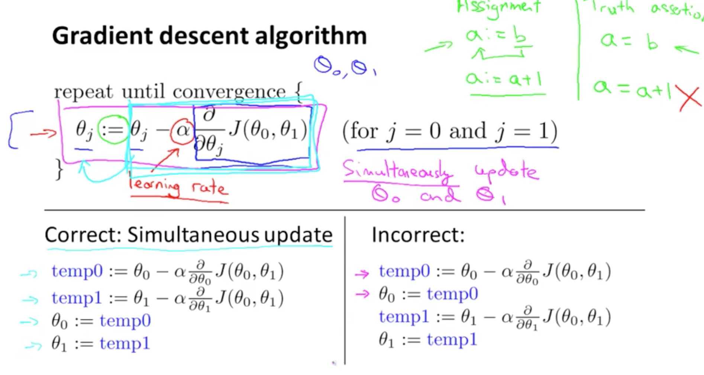
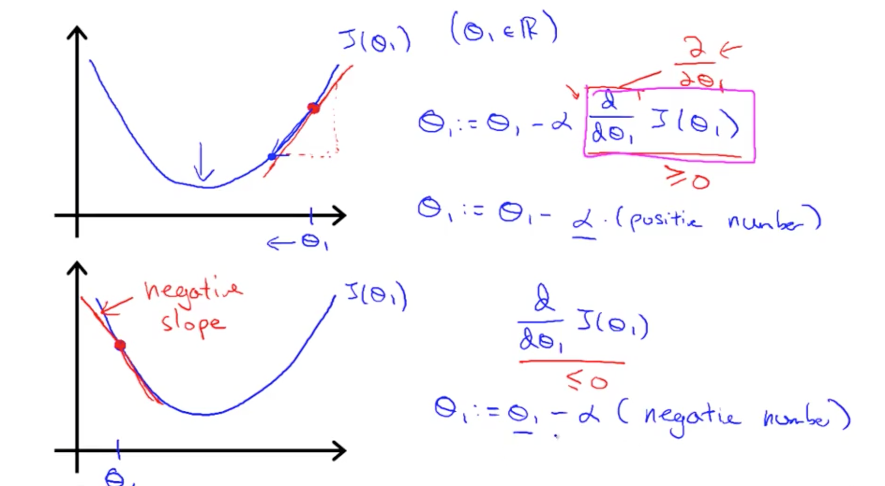
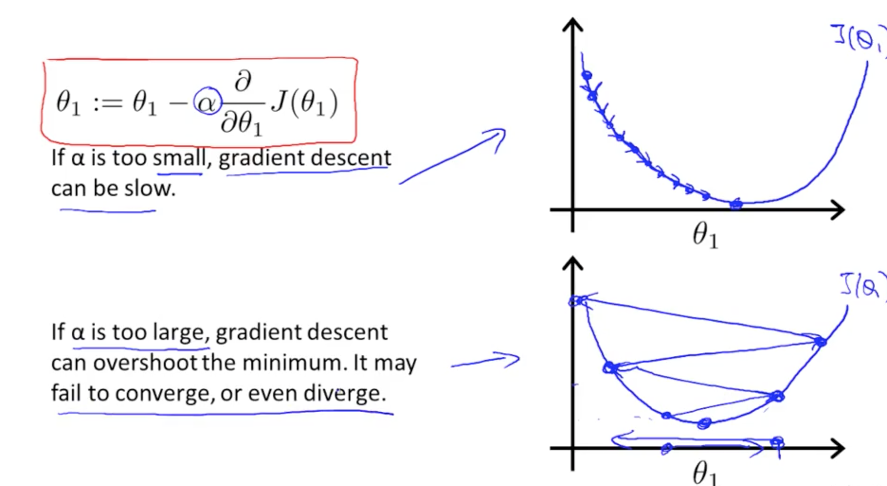
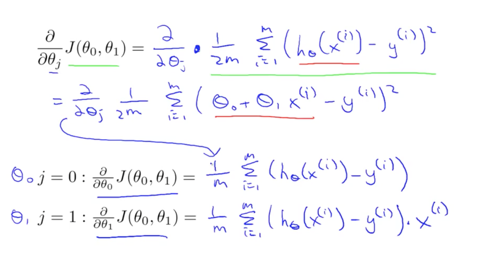
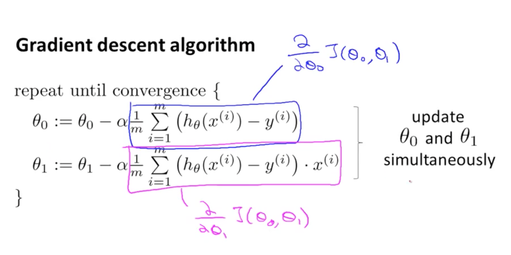

# Introduction to Machine Learning: Supervised and Unsupervised Learning

## Examples of ML
- Database Mining
- Applications that can't program by hand
    - Handwriting recognition
    - NLP
- Self-customising programs
    - Amazon
    - Netflix recommendation systems
- Understand human learning
    - Brain
    - Real AI

## 1. Supervised Learning
- Gave data set answers
- Regression: predict continuous valued output

### 1a. Classification
- Discrete valued output (0 or 1)
- Example: Breast cancer (malignant and benign)
    1. Tumor size
    2. Age
        - Classify 2 clusters to determine which is more likely

### 1c. Problem 1 (Regression Problem)
You have a large inventory of identical items. You want to predict how many
of these items will sell within the next 3 months.
    10000 items (continuous value)

### 1d. Problem 2 (Classification Problem)
You'd like a software to examine individual accounts and decide, for each account,
if it has been hacked/compromised.
    0: not hacked
    1: hacked

## 2. Unsupervised Learning 
- Making sense of data; patterns we don't know in advance
- Examples
    - Social network analysis
    - Market segmentation
    - Astronomical data analysis

### 2a. Cocktail Party Problem
- Give 2 audio recording
- Feed to unsupervised learning algorithm
- Find structure
    - Separate audio sources

### Unsupervised Learning Problems
    1. Given a set of news articles found on the web, group them into set of articles about
       the same story
    2. Given a database of customer data, automatically discover market segments and group
       customers into different market segments

## 3. Model and Cost Function

### 3a. Model Representation
- Supervised learning: given the right answer for each example in the data
- Regression: predict real-valued output
- Classification: predict discrete-valued output
- Training set: original data
    - m = number of training examples
    - x = input variable/features
    - y = output variable/target
    - (x, y) = one training example
    - (x^(i), y^(i)) = i-th training example
- Representing hypothesis h
    - linear regression with one variable (univariate linear regression)
        - h(x) = a + bx 
            - a,b: parameters

### 3b. Cost Function
- Minimise squared error function

### 3c. h(x) and J(theta): 1 Parameter
- Assuming simplified cost function with only theta1
- Minimising J(theta) would fit the data most well 

### 3d. h(x) and J(theta0, theta1): 2 Parameters
- 3D graph

- Contour graphs 
    - Minimum is in the smallest concentric circle

## 4. Parameter Learning

### 4a. Gradient Descent 
- Concept

- Gradient Descent Algorithm
    - repeat until convergence
    - a:= b (this means assignment)
    - a = b (truth assertion)
    - alpha (number, learning rate)
        - large: aggressive gradient descent
    - derivative: slope of J(theta)
    

### 4b. Gradient Descent Intuition

- Derivative intuition

- Alpha intuition

    - If already at local optima --> derivative = 0
        - Theta will not change! 
    - Steps will be smaller even with alpha fixed
        - This is because derivative decreases (slope decreases) nearing local minimum

### 4c. Gradient Descent for Linear Regression
- Apply gradient descent algorithm to linear regression
- _For derivative: d (single parameter), delta (multiple derivative, partial differentiation)_
- Plug J(theta_0, theta_1) into Gradient Descent's derivative

- Cost function for linear regression will always be convex function
    - One global minimum

    - Gradient descent for linear regression
        - Keep changing parameters to reach global minimum
        - This is called "Batch Gradient Descent"
        - Each step uses all the training examples (batch)

