# Neural Networks: Representation

## 1. Motivations

### 1a. Non-linear Hypothesis
- You can add more features
    - But it will be slow to process
- If you have an image with 50 x 50 pixels (greyscale, not RGB)
    - n = 50 x 50 = 2500
    - quadratic features = (2500 x 2500) / 2
    - 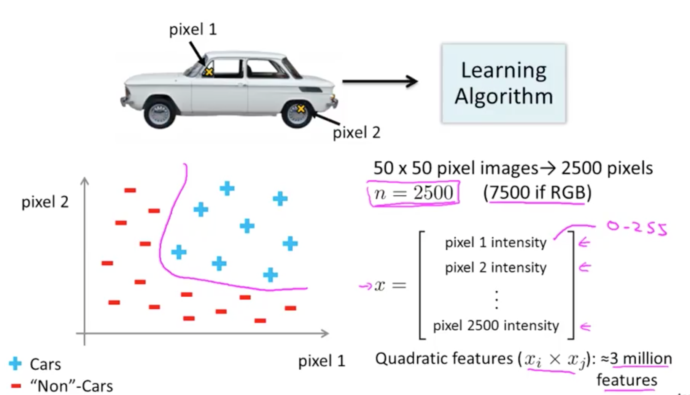
- Neural networks are much better for a complex nonlinear hypothesis 

### 1b. Neurons and the Brain
- Origins
    - Algorithms that try to mimic the brain
- Was very widely used in the 80s and early 90's
    - Popularity diminished in the late 90's
- Recent resurgence
    - State-of-the-art techniques for many applications
- The "one learning algorithm" hypothesis
    - Auditory cortex handles hearing
        - Re-wire to learn to see
    - Somatosensory cortex handles feeling
        - Re-wire to learn to see
    - Plug in data and the brain will learn accordingly
- Examples of learning
    - 

## 2. Neural Networks

### 2a. Model Representation I
- Neuron in the brain
    - Many neurons in our brain
    - Dendrite: receive input 
    - Axon: produce output
        - When it sends a message through the Axon to another neuron
        - It sends to another neuron's Dendrite 
    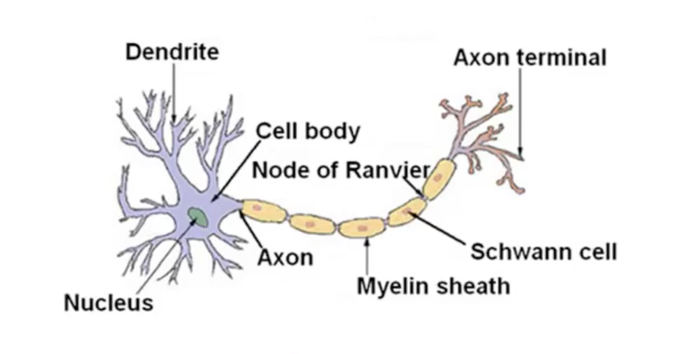
- Neuron model: logistic unit
    - Yellow circle: body of neuron
    - Input wires: dendrites
    - Output wire: axon
    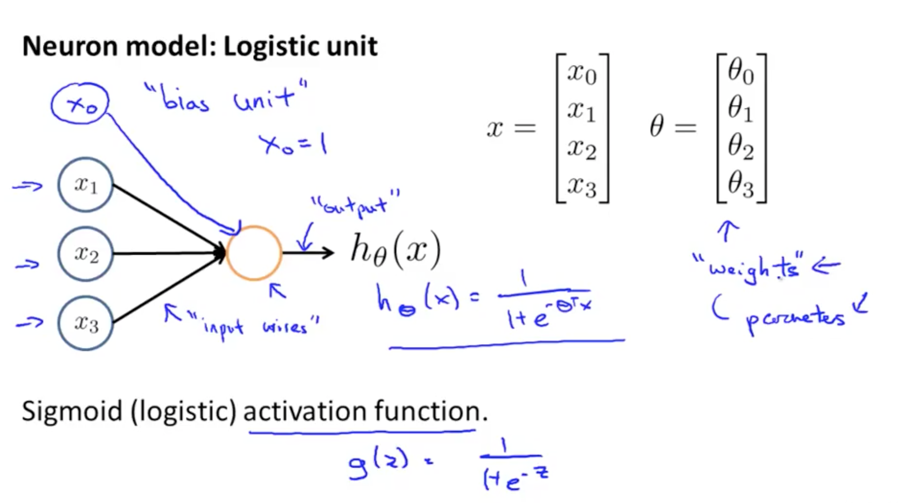
- Neural Network
    - 3 Layers
        - 1 Layer: input layer
        - 2 Layer: hidden layer 
            - Unable to observe values
            - Anything other than input or output layer
        - 3 Layer: output layer
        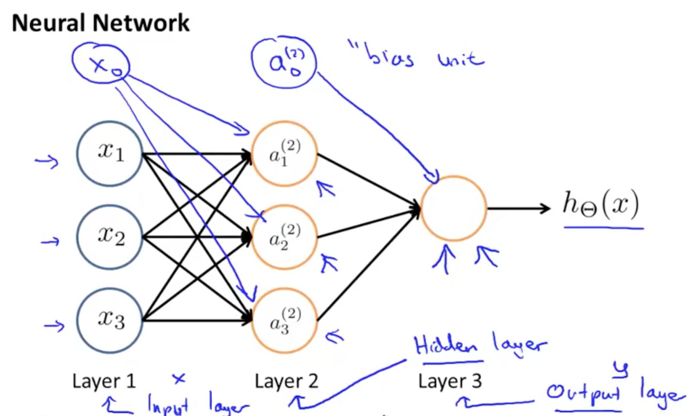
        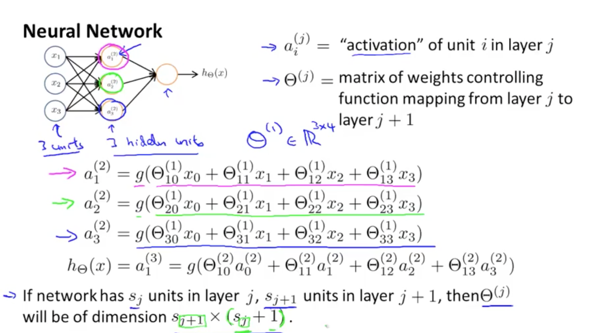
        - We calculate each of the layer-2 activations based on the input values with the bias term (which is equal to 1)
            - i.e. x0 to x3 
            - We then calculate the final hypothesis (i.e. the single node in layer 3) using exactly the same logic, except in input is not x values, but the activation values from the preceding layer
        - The activation value on each hidden unit (e.g. a12 ) is equal to the sigmoid function applied to the linear combination of inputs
            - Three input units
            - Ɵ(1) is the matrix of parameters governing the mapping of the input units to hidden units
                - Ɵ(1) here is a [3 x 4] dimensional matrix
        - Three hidden units
            - Then Ɵ(2) is the matrix of parameters governing the mapping of the hidden layer to the output layer
                - Ɵ(2) here is a [1 x 4] dimensional matrix (i.e. a row vector)
        - Every input/activation goes to every node in following layer
            - Which means each "layer transition" uses a matrix of parameters with the following significance
            
                - j (first of two subscript numbers)= ranges from 1 to the number of units in layer l+1
                - i (second of two subscript numbers) = ranges from 0 to the number of units in layer l
                - l is the layer you're moving FROM
                

- Notation
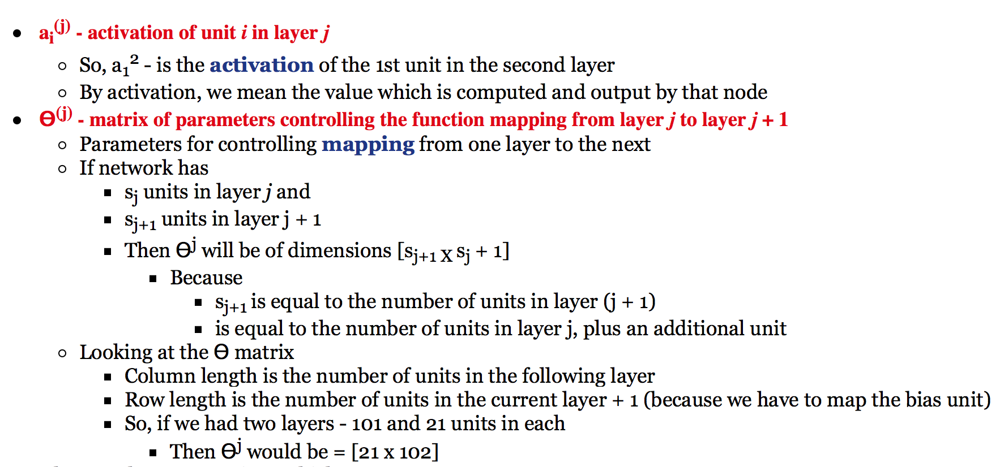

        
### 2a. Model Representation II
- Here we'll look at how to carry out the computation efficiently through a vectorized implementation. We'll also consider 
why neural networks are good and how we can use them to learn complex non-linear things
- Forward propagation: vectorized implementation
    - g applies sigmoid-function element-wise to z
    - This process of calculating H(x) is called forward propagation
        - Worked out from the first layer
        - Starts off with activations of input unit
        - Propagate forward and calculate the activation of each layer sequentially
        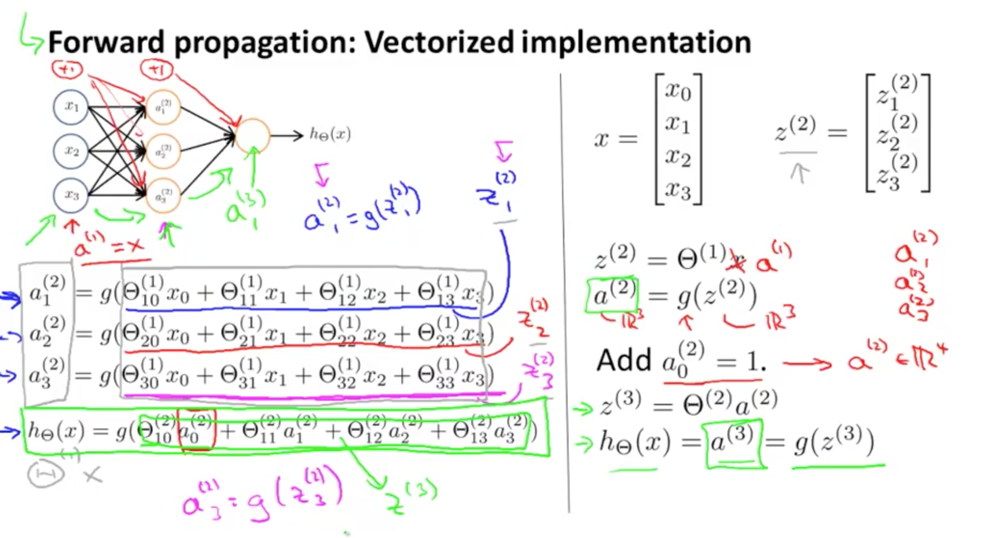
- Similar to logistic regression if you leave out the first layer
    - Only second and third layer 
    - Third layer resembles a logistic regression node
    - The features in layer 2 are calculated/learned, not original features
    
    - Neural network, learns its own features
        - The features a's are learned from x's
        - It learns its own features to feed into logistic regression
        - Better hypothesis than if we were constrained with just x1, x2, x3
        - We can have whatever features we want to feed to the final logistic regression function
        - Implemention in Octave for a2
            - `a2 = sigmoid (Theta1 * x);`
        
- Other network architectures
    - Layer 2 and 3 are hidden layers
    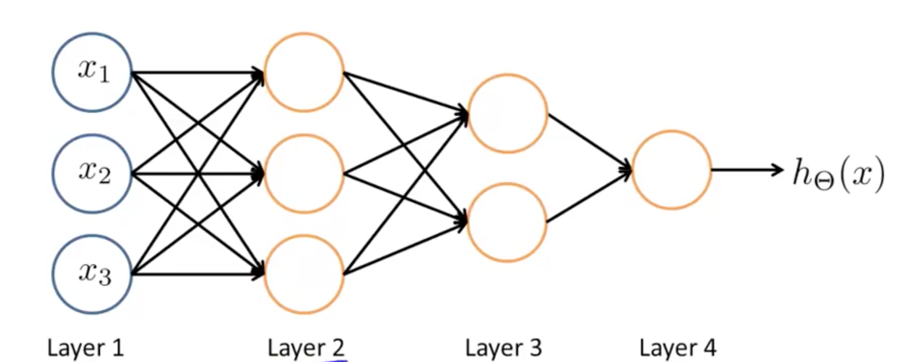

## 2. Neural Network Application

### 2a. Examples and Intuitions I
- XOR/XNOR
    - XOR: or  
    - XNOR: not or 
    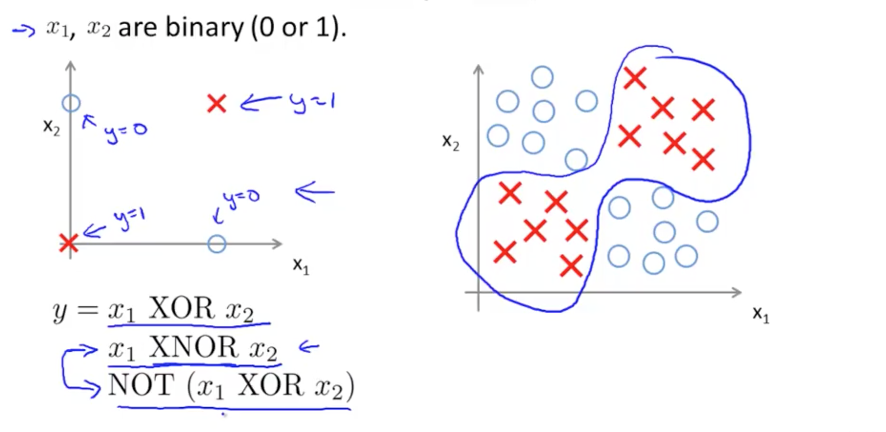
    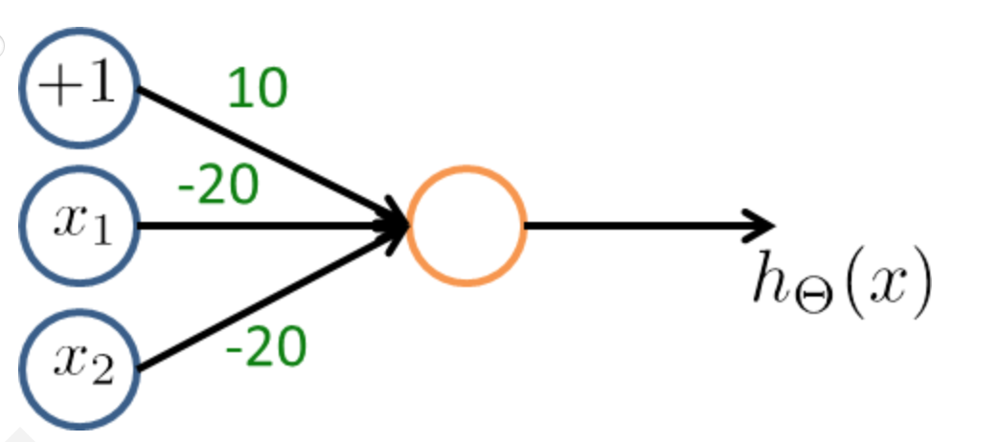
- AND function
    - Outputs 1 only if x1 and x2 are 1
    - Draw a table to determine if OR or AND
    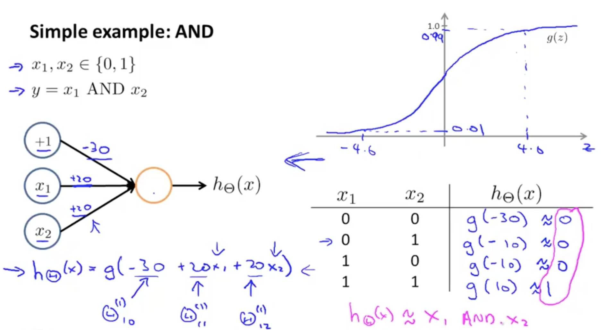
- NAND function
    - NOT AND
    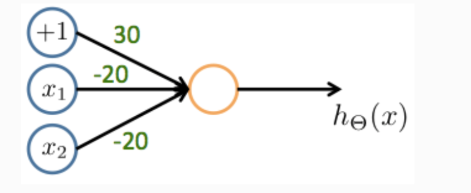
- OR function
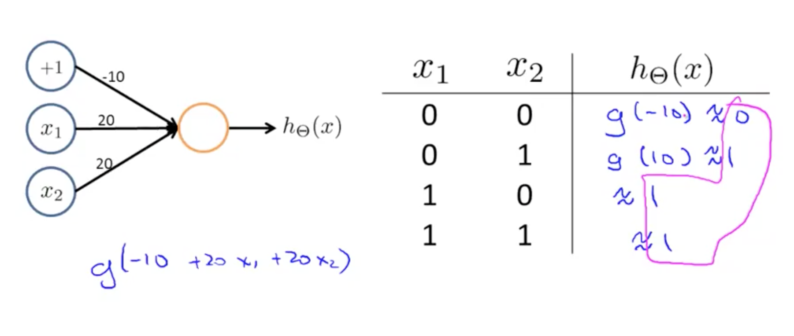

### 2b. Examples and Intuitions II
- NOT function
    - 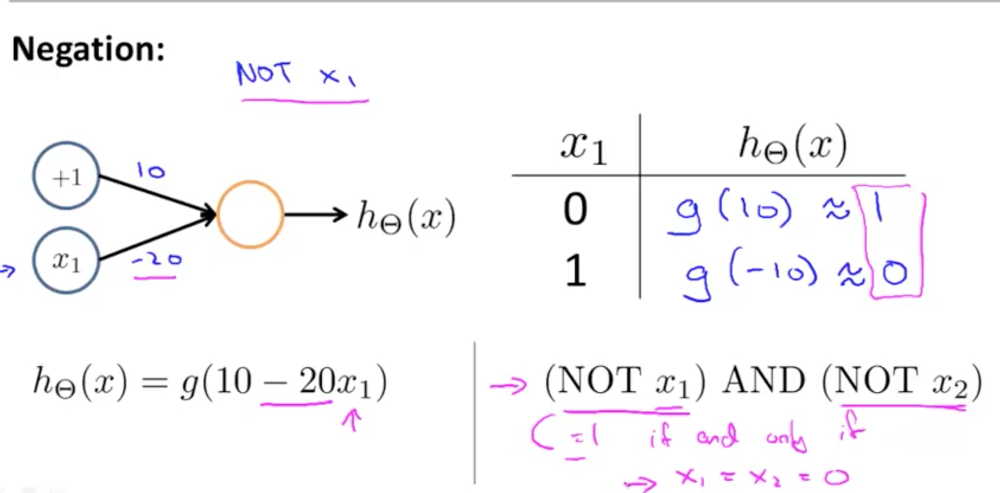
- XNOR function
    - NOT XOR
    - NOT an exclusive or 
        - Hence we would want 
            - AND 
            - Neither 
        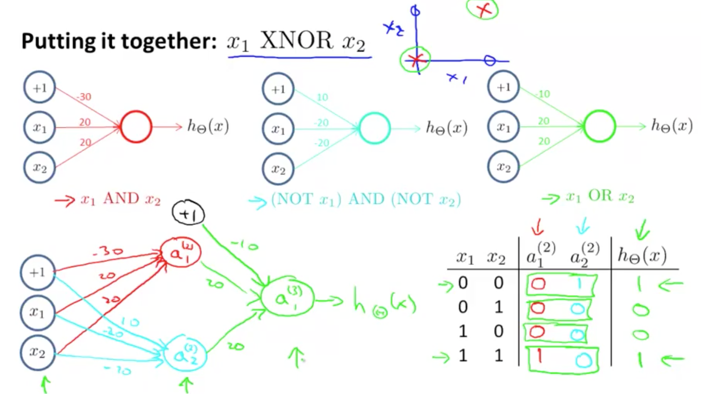

### 2c. Multi-class Classification
- Example: identify 4 classes
    - You would want a 4 x 1 vector for h_theta(X)
    - 4 logistic regression classifiers in the output layer
    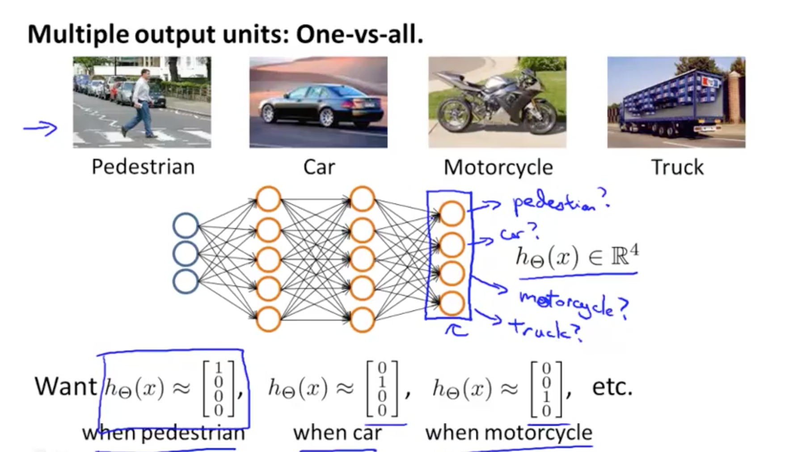
    - There will be 4 output
    - y would be a 4 x 1 vector instead of an integer
    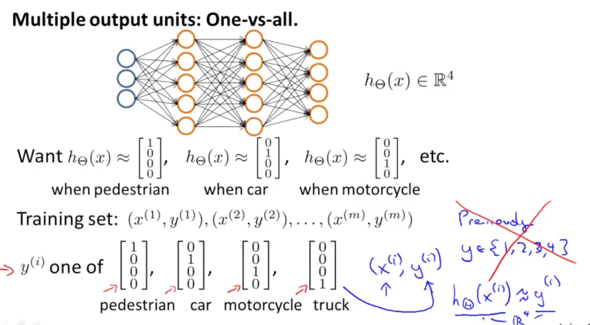