# Applying Machine Learning

## 1. Evaluating Learning Algorithm
### 1a. Deciding what to try next
- Suppose you have implemented regularized linear regression to predict housing prices
    - However, when you test your hypothesis your hypothesis on new set of houses, you find that it makes unacceptably large errors
        - You can do the following
            - Get more training data
            - Smaller set of features
            - Get additional features
            - Try adding polynomial features
            - Try decreasing lambda 
            - Try increasing lambda
        - Typically people randomly choose these avenues and then figure out it may not be suitable
        - There is a simple technique to weed out avenues that are not suitable
            - Machine Learning Diagnostic
                - Test that you can run to gain insight what is or isn't working with a learning algorithm and gain guidance as to how best to improve its performance
                - Diagnostics can take time to implement, but doing so can be a very good use of your time
                - But it's worth the time compared to spending months on unsuitable avenues
                
### 1b. Evaluating a hypothesis
- In fitting parameters to your training data, you would want to lower your training error to the minimum
- How to tell if over-fitting?
    - You can plot for few features
    - For many features: training/testing procedure
        - Split into 2 portions
            - Training set
            - Test set
                - Randomly re-order data before splitting
        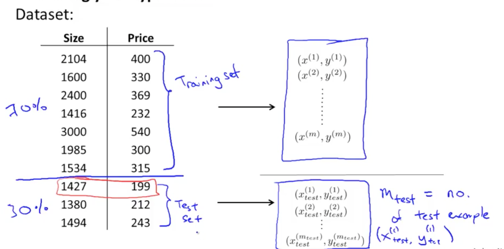
- Training/testing procedure: linear regression
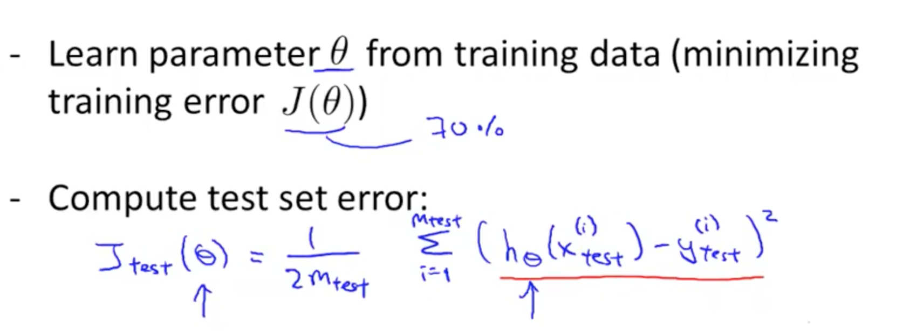
- Training/testing procedure: logistic regression
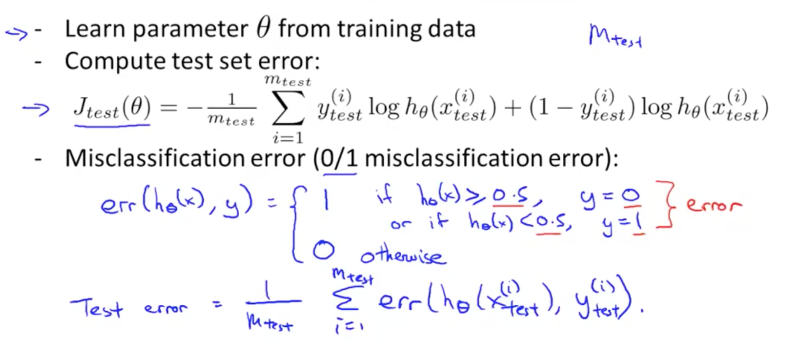
                
    
### 1c. Model selection and Train/Validation/Test Sets
- Model selection
    - We can create an extra parameter d which is the degree of polynomial
    - You can measure the test error on each parameter θ
        - If you choose d = 5 and to determine how well the model generalizes, you can report test set error on Jtest(θ5)
            - But there is a problem: Jtest(θ5) is likely an optimistic estimate of generalization error
            
- To address the problem, we can do the following
    - Split data into 3 categories
        - Training set
        - Cross validation set or Validation set or CV
        - Test set
        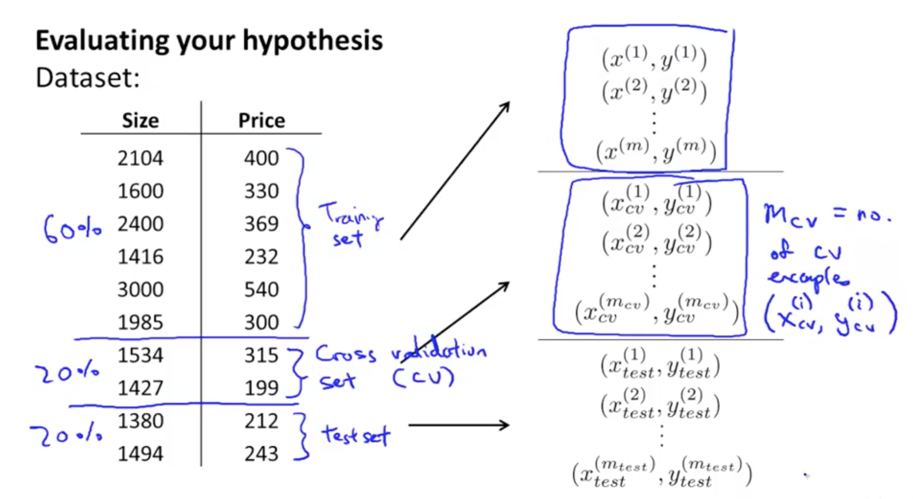
    - You would have the following 3 errors
        - Training error
        - Cross validation (CV) error
        - Test error
        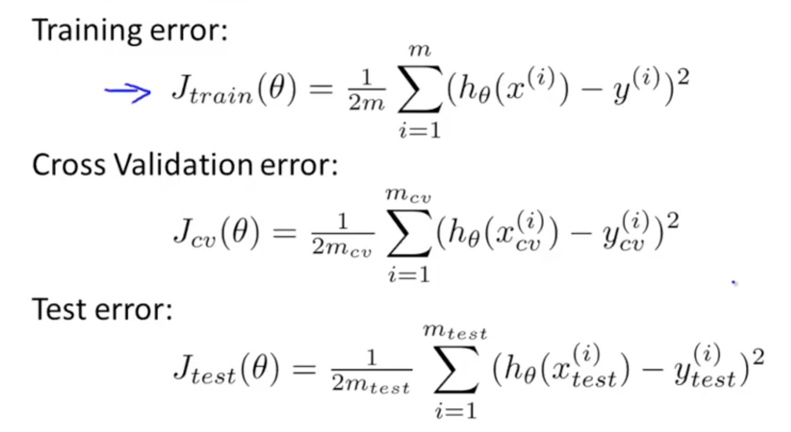
- We would test on cross-validation sets 
    - Pick hypothesis with lowest CV error
    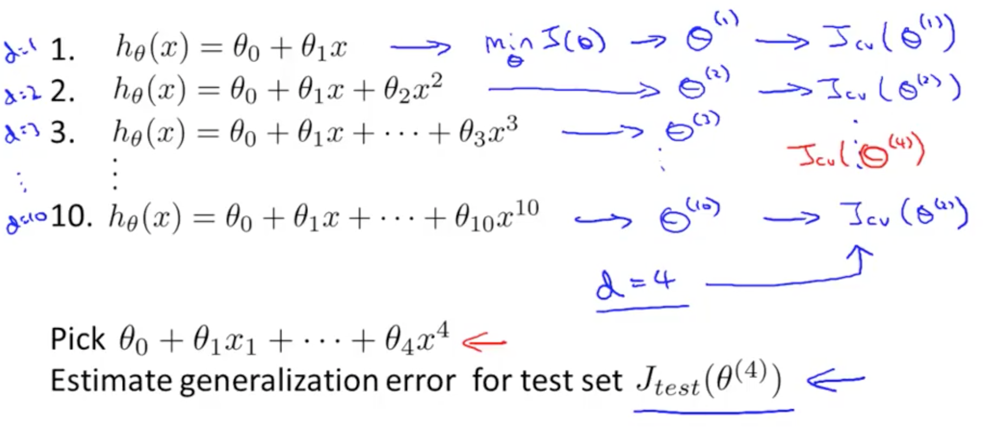

## 2. Bias vs Variance
### 2a. Diagnosing vs Variance
- When you run an algorithm and it doesn't do as well as you hope, it typically has a high bias or high variance issue
    - High bias (underfitting)
    - High variance (overfitting)
    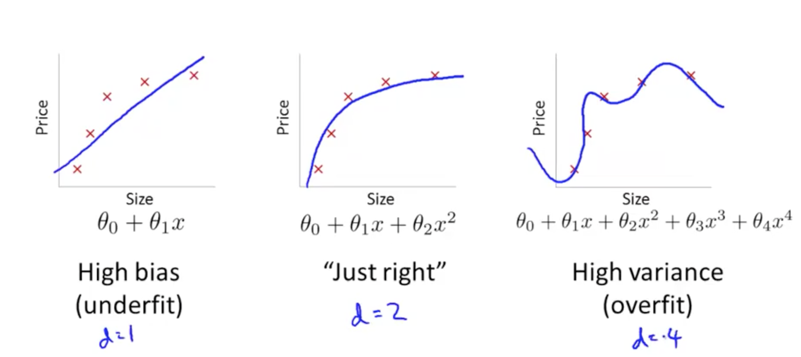
- Plot error against degree of polynomial, d
    - As you increase your polynomial, d, 
        - Training error decreases from underfitting to overfitting
        - Cross validation (CV) error example
            - d = 1: underfitting, high CV error
            - d = 2: lower CV error due to better fit
            - d = 4: overfitting, high CV error
            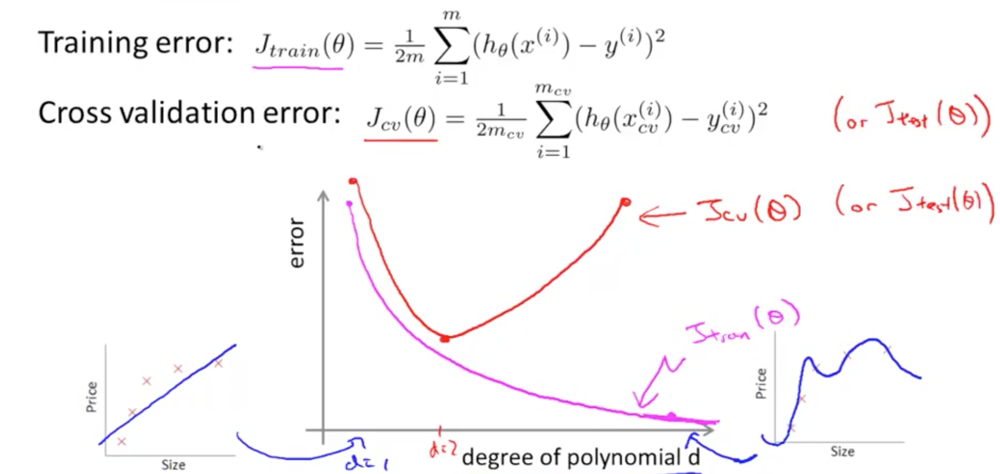
- How do we distinguish between a high bias or a high variance issue?
    - High Bias Error
        - High Jtrain(θ) 
        - Jtrain(θ) = Jcv(θ)
    - High Variance Error
        - Low Jtrain(θ)
        - Jcv(θ) >> Jtrain(θ)
            - Much greater as seen on the right of the graph
            
            
### 2b. Regularization and Bias/Variance
- Linear regression with regularization
    - Large λ
        - High bias (underfit)
    - Small λ
        - High variance (overfit)
    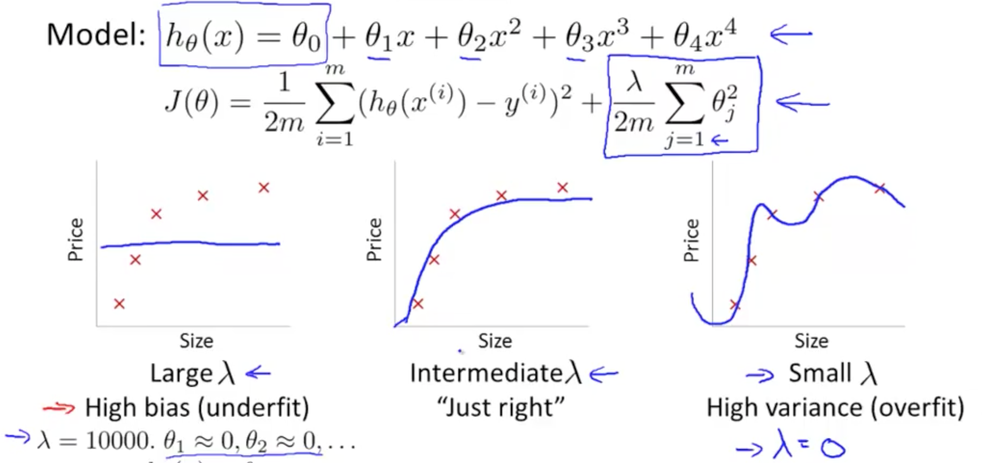
- So how do we choose a good value of λ?
    - H(θ): algorithm; hypothesis
    - J(θ): cost function; optimization objective
    - Jtrain(θ), Jcv(θ), Jtest(θ): optimization objectives without regularization terms
    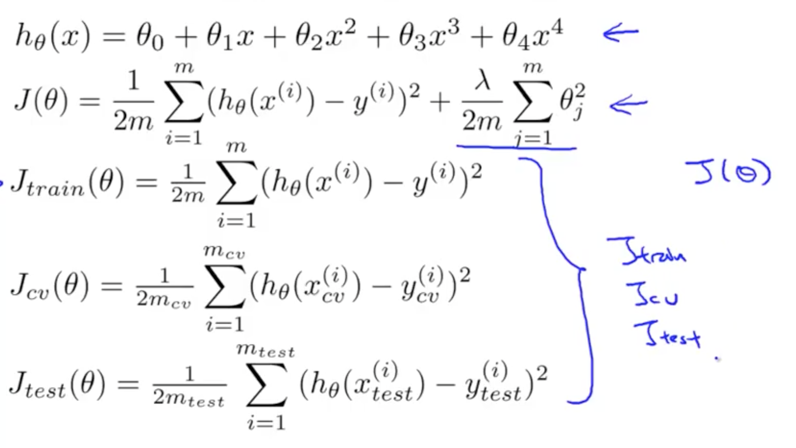
    - **Steps**
        - Try λ in multiples of 2 on J(θ)
            - Minimise J(θ) to get θ
        - Try λ in multiples of 2 on Jcv(θ) 
            - Minimise Jcv(θ) to get θ
        - Choose lowest Jcv(θ), θ_low
            - Where θ_low is θ_5 in the example since Jcv(θ_5) is the lowest
        - Pick Jcv(θ), θ_low
            - Try for Jtest(θ_low)
            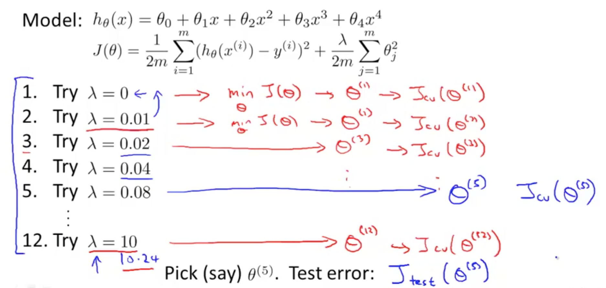
- How CV and test error vary as we vary λ?
    - Jtrain(θ)
        - Small λ
            - Regularization term is small
            - Hypothesis fits better to the data
            - Low Jtrain(θ) 
        - Large λ
            - Regularization term is large
            - Hypothesis does not fit well to the data
            - High Jtrain(θ) 
    - Jcv(θ)
        - Large λ
            - Regularization term is large
            - High bias (underfitting)
            -   Large Jcv(θ)
        - Small λ
            - Regularization term is small
            - High variance (overfitting)
            - Small Jcv(θ)
            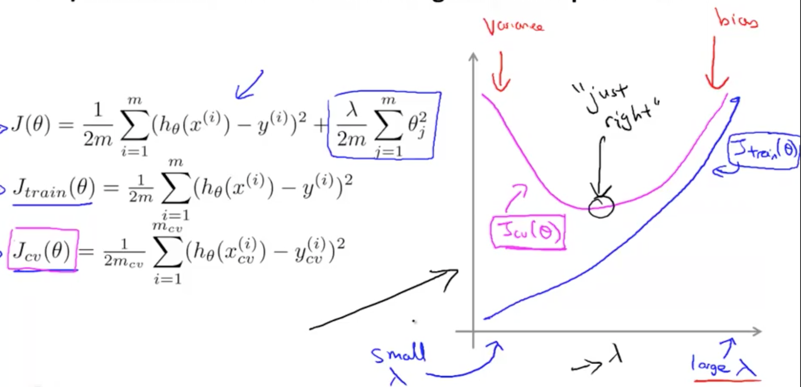
    - For a real dataset, the graph is messier, but the general trend is similar
    
### 2c. Learning Curves
- What is the effect of m, number of training examples, on training error?
    - For m = 1, 2, 3 in the example
        - If the training set is small
        - Easier to fit every single training example perfectly
        - Your training error = 0 or small
    - For m = 4, 5, 6
        - If the training set grows larger
        - Harder to fit every single training example perfectly
        - Your training error increases
    - In general, when m increases, training error increases
- What is the effect of m, number of training examples, on cross validation error?
    - The more data you have, where m increases
        - Your cross validation error decreases
        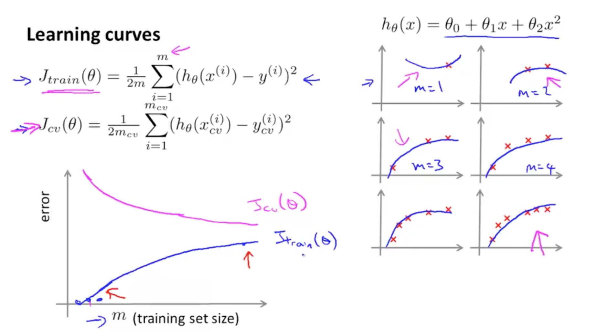
- High Bias (Underfit)
    - Your cross validation error decreases, but it decreases to a high value
        - Even if you have large m, you still have a straight line with a high bias
        - Your cross validation error would still be high
    - Your training error increases close to the level achieve from your cross validation error
    - If a learning algorithm is suffering from high bias, getting more training data will not (by itself) help much
        - As seen from the two graphs, even with a higher m, there's no use collecting more data to decrease your cross validation error
    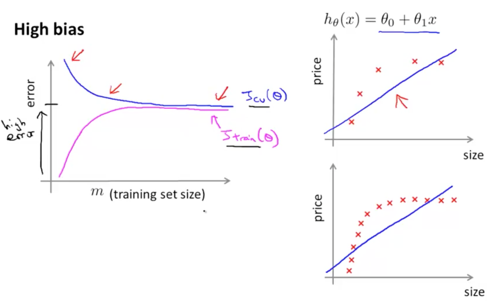
- High Variance (Overfit)
    - Training error would remain small
        - This happens when you use a small λ
        - Your training error increases with m because it becomes harder to fit your data
    - Cross validation error would remain high
        - This happens when you use a small λ
    - If a learning algorithm is suffering from high variance, getting more data is likely to help
    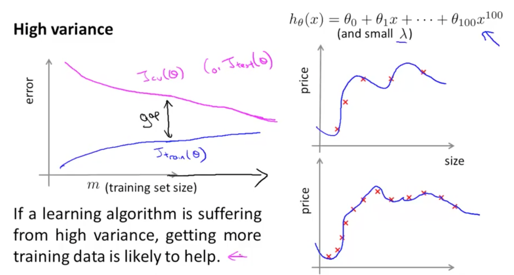

### 2d. Improving Algorithm Performance
- Suppose you have implemented regularized linear regression to predict housing prices
    - However, when you test your hypothesis your hypothesis on new set of houses, you find that it makes unacceptably large errors
        - **You can do the following**
            - Get more training data
                - Fixes high variance
            - Smaller set of features
                - Fixes high variance
                    - Features are too complicated
            - Get additional features
                - Fixes high bias
                    - Features are too simple
            - Try adding polynomial features
                - Fixes high bias
                    - Too low d
            - Try decreasing lambda 
                - Fixes high bias
                   - Because you would have a smaller regularized term, giving more importance to other features
            - Try increasing lambda
                - Fixes high variance
                   - Because you would have a larger regularized term, giving less importance to other features
- Neural Networks and Overfitting
    - If you are fitting a neural network, you can use a small or large neural network
    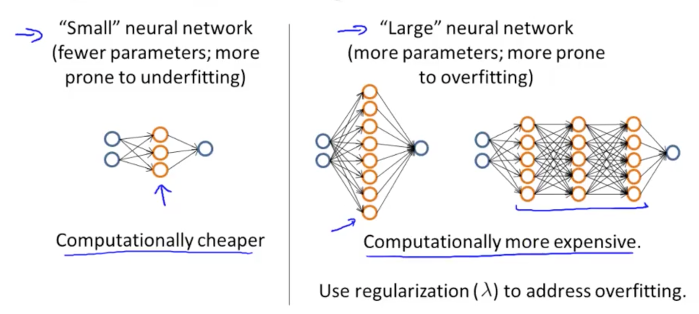
        - Small neural network
            - 1 hidden layer
            - 1 input layer
            - 1 output layer
                - Computationally cheaper
        - Large neural network 
            - Multiple hidden layers
            - 1 input layer
            - 1 output layer
                - Computationally expensive
    

