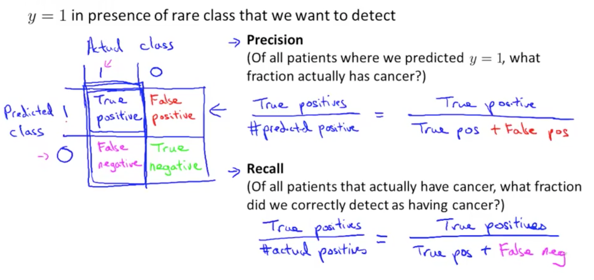
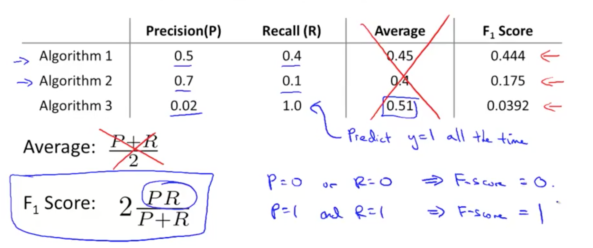
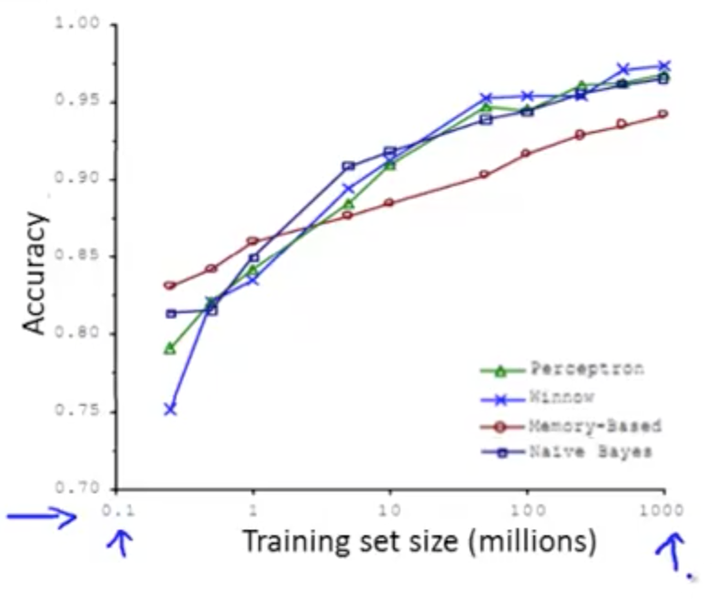
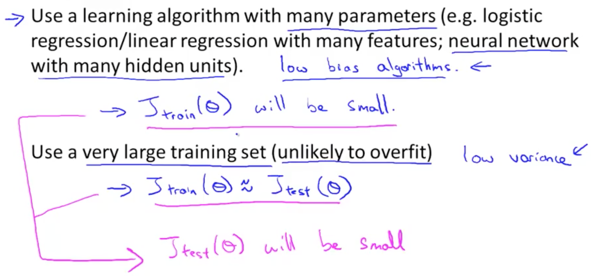

# Machine Learning Systems Design

## 1. Building a Spam Classifier
### 1a. Prioritizing 
- Let's say you want to build a spam classifier
- How do you implement supervised learning?
    - We can create the following
        - x = features of email
            - Choose 100 words indicative of spam or not spam
            - In practice is to look through training set and choose most frequently occurring n words (10 000 to 50 000)
        - y = spam (1) or non-spam (0)
        - Example
        
- How do you spend your time to have a low error?
    - Collect lots of data
    - Develop sophisticated features based on email routing information (from email header)
    - Develop sophisticated features for message body
        - Should 'discount' and 'discounts' be treated as the same word?
        - How about 'deal' and 'Dealer'?
        - Punctuation?
    - Develop sophisticated algorithm to detect misspellings
        - med1cine
        - w4tches
        - m0rtage
- Don't base on your gut feeling!

### 1b. Error Analysis
- Recommended Approach
    - Start with a simple algorithm that you can quickly implement and test it on your cross validation data
    - Plot learning curves to decide if more data, more features, etc. are likely to help
    - Error analysis:
        - Manually examine the examples (in cross validation set) that your algorithm made errors on
        - See if you spot any systematic trend in what type of examples it is making errors on
        - Don't base anything off your gut feeling! 
- Error Analysis Example
    - m_cv = 500
        - number of cross-validation examples
    - Algorithm misclassified 100 emails
    - Manually examine the 100 errors and categorize them base don
        - What type of email they are
            - Pharma: 12 
            - Replica: 4
            - Phishing: 53
            - Other: 31
        - What cues (features) you think would have helped the algorithms classify them correctly
            - Deliberate misspellings: 5
                - m0rtgage
                - med1cine
                    - This indicates how there are a small number here
            - Unusual email routing: 16
            - Unusual punctuation: 32
                - This might be worthwhile to spend time to develop sophisticated features
    - This is the reason why we should do a quick and dirty implementation to discover errors and identify areas to focus on
- Importance of numerical evaluation
    - Should discount, discounts, discounted, discounting etc. be treated as the same word?
        - You can use a "stemming" software, "Porter Stemmer"
        - This would allow you to treat all those variations as the same work
            - Software may mistake universe and university as the same word
        - Error analysis may not be helpful for deciding if this is likely to improve performance
            - The only way is to try it
            - We need a numerical solution (cross validation error)of algorithm's performance with and without stemming
                - Without stemming: 5%
                - With stemming: 3% 
                    - This implies that it may be useful to implement stemming
                - Distinguish between upper and lower case: 3.2% 
- Why is the recommended approach to perform error analysis using the cross validation data instead of the test data?
    - If we develop new features by examining the test set, then we may end up choosing features that work well specifically for the test set, so Jtest(θ) is no longer a good estimate of how we generalize to new examples
    - Do error analysis on cross validation set, do not use it on the test set!

## 2. Handling Skewed Data

### 2a. Error Metrics for Skewed Classes
- Consider a problem where you want to find out if someone has cancer
    - y = 1, cancer
    - y = 0, no cancer
    - You train a logistic regression model, h0(x) and you find that you have 1% error on a test set
        - 99% correct diagnosis
    - But only 0.50% of patients have cancer
        - This is a problem of skewed classes
        - This code would have a 0.5% error, lower than your logistic regression model but it's simply predicting based on 0.5% of patients who have cancer
        ```
        function y = predictCancer(x)
            y = 0;
        return
        ```
    - Let's say you have
        - 99.2% accuracy
            - 0.8% error
        - If you improve your algorithm to become 99.5% accuracy
            - 0.5% error
            - It might be the case of just predicting whether you have cancer that would yield this error
- Precision/Recall
    - By calculating precision/recall, we will have a better sense of how our algorithm is doing
        - If y = 0
            - Recall = 0
            - This shows that the classifier is not good


### 2b. Trading off Precision and Recall
- If we want to avoid false positives
    - We want to be more confident before predicting cancer (y = 1)
    - We can increase the threshold of h0(x) from 0.5 to 0.7 or even 0.9
    - Result
        - False positives: decrease
        - True positives: decrease
        - Recall: decrease
        - Precision: higher
- If we want to avoid false negatives
    - We want to avoid missing too many cases of cancer
    - We can decrease the threshold of h0(x) from 0.5 to 0.3
    - Result
        - False negatives: decrease
        - True positive: increase
        - Recall: higher
        - Precision: lower
- Many different precision recall curve, but here is one example

- How do we compare precision/recall numbers? Which pair is best?
    - We can use an average
        - At the extremes, neither classifiers is good
        - If we predict y = 1 all the time, it's a useless classifier even though if it has a high recall
        - But average is not good because the extreme scenarios may have a lower average than other combinations that may be better
    - We should use the F score (F1 score)
        - F1 Score = (2 * P * R) / (P + R)
        - Remember to measure P and R on the cross-validation set and choose the threshold which maximizes the F-score
        
        
## 3. Using Large Data Sets
- Under certain conditions, getting a lot of data and training a learning algorithm would result in very good performance
- Designing a high accuracy learning system
    - Classify between confusable words
        - to, two, too
        - then, than
    - For breakfast, I ate two eggs
    - Algorithms
        - Perceptron (logistic regression)
        - Winnow (less popular)
        - Memory-based (less popular)
        - Naive Bayes (popular)
    - Algorithms give roughly similar performance
        - With larger training set, all algorithms' precision increase
        
- Often, it is not who has the best algorithm, but who has the most data
- Large data rationale


- In sum
    - Low bias: use complex algorithm
    - Low variance: use large training set