# Anomaly Detection

## 1. Density Estimation

### 1a. Problem Motivation
- Anomaly detection example in aircraft engines
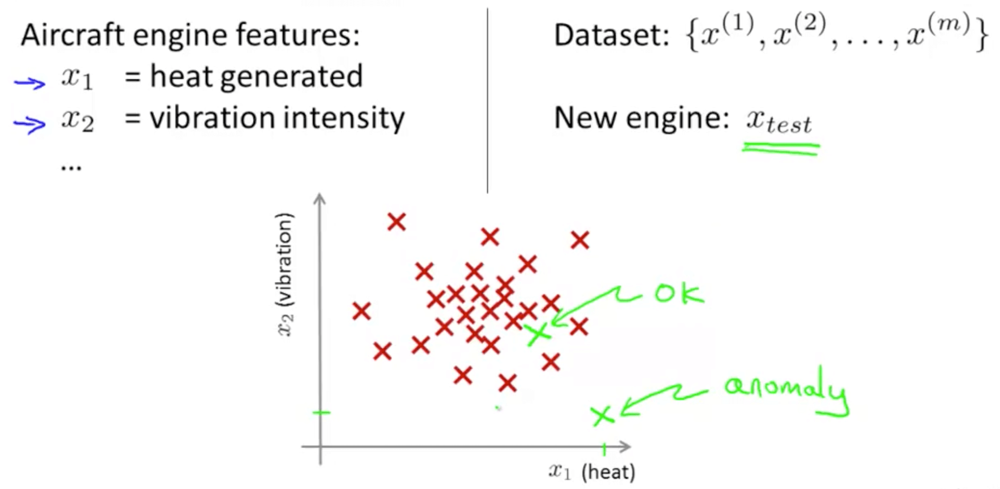
    - Density estimation
    
- Other anomaly detection examples 
    - If you have too many false positives
        - Detecting positives when they are not
        - Decrease ε
        

### 1b. Gaussian (Normal) Distribution
- This is also called Normal Distribution
    - We will be using the Gaussian Distribution to develop an anomaly detection algorithm
- Introduction

- Gaussian distribution example
    - Area under the graph (red shaded area) must always equate to 1
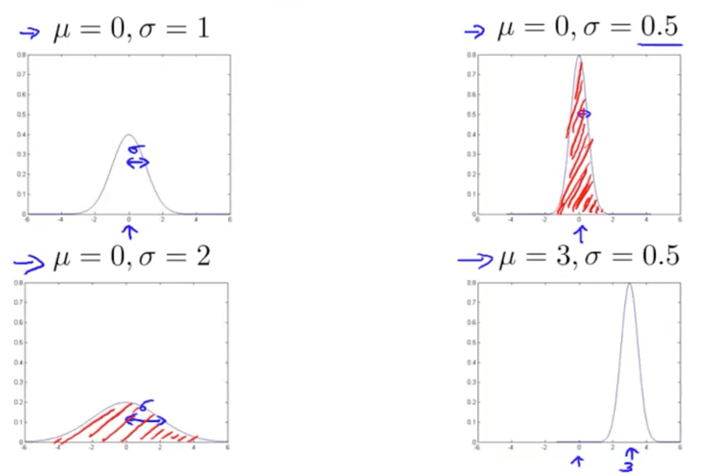
- Parameter estimation
    - m might be (m - 1)
        - In practice, it makes very little difference
        - In machine learning, most people typically use (1 / m)
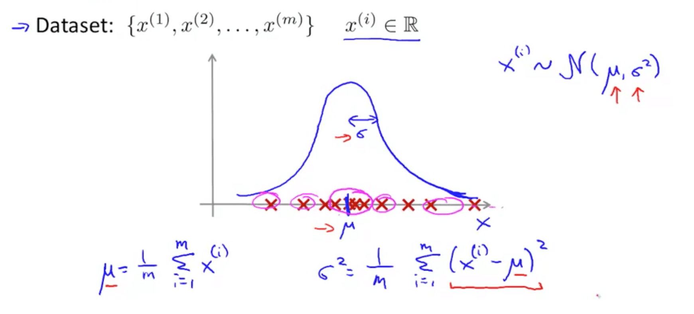
- Now we will use the Gaussian distribution to develop an anomaly detection algorithm

### 1c. Algorithm
- Density estimation
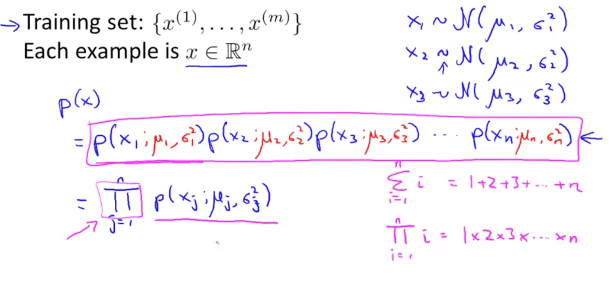
- Anomaly detection algorithm
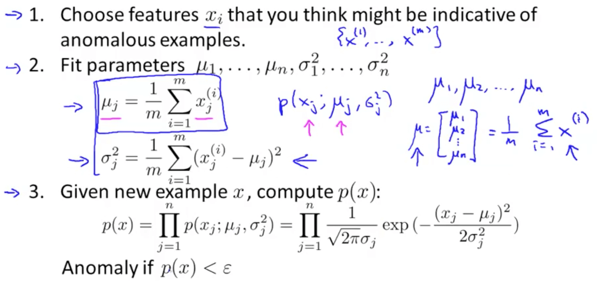
- Anomaly detection example
    - Height of contour graph = p(x)
    - Set some value of ε
    - The pink shaded area on the contour graph have a low probability hence they're anomalous
    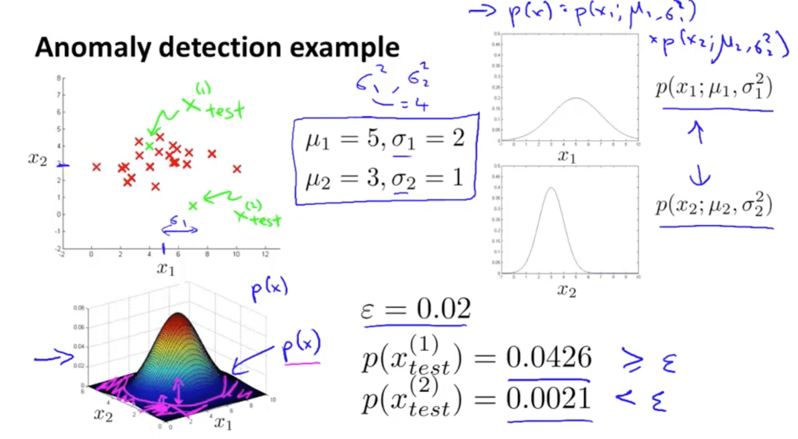

## 2. Building an Anomaly Detection System

### 2a. Developing and Evaluating an Anomaly Detection System
- Importance of real-number evaluation
    - When developing a learning algorithm (choosing features etc.), making decisions is much easier if we have a way of evaluating our learning algorithm
    - Assume we have some labeled data, of anomalous and non-anomalous examples
        - y = 0 if normal
        - y = 1 if anomalous
    - Training set (x1, x2, ..., xm)
        - Assume normal examples, not anomalous
    - Cross validation set (xcv_1, xcv_2, ..., xcv_m)
    - Test set (xtest_1, ..., xtest_m)
- Aircraft engines example
    - 10,000 good (normal) engines
    - 20 flawed (anomalous) engines
        - Training set: 6000 good engines
            - This will be used to fit p(x)
        - CV: 2000 good engines (y = 0), 10 anomalous (y = 1)
        - Test: 2000 good engines (y = 0), 10 anomalous (y = 1)
- Algorithm Evaluation
    - Because y = 0 is more common, there is a skewed data set
        - Hence, classification metric is not appropriate
        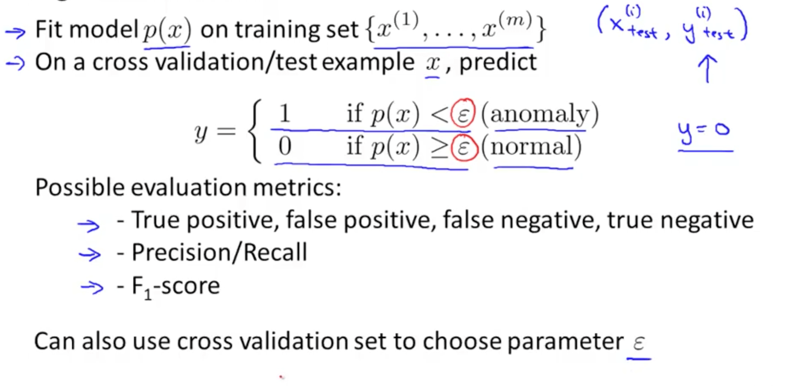

### 2b. Anomaly Detection vs Supervised Learning
| Anomaly Detection   |      Supervised Learning      |
|----------|-------------|
| Very small number of positive examples (y = 1 such that 0-20)  |  Large number of positive and negative examples |
| Large number of negative examples (y = 0) |       |
| Many different types of anomalies. Hard for any algorithm to learn from positive examples what the anomalies look like; future anomalies may look nothing like any of the anomalous examples we have seen so far. | Enough positive examples for algorithm to get a sense of what positive examples are like, future positive examples likely to be similar to ones in training set. |
| Fraud Detection | Email Spam Classification |
| Manufacturing | Weather Prediction |
| Monitoring machines in a data center | Cancer Classification |

### 2c. Choosing What Features to Use
- Non-gaussian features
    - If the data is non-gaussian, you can transform the data to make it resemble a gaussian distribution
    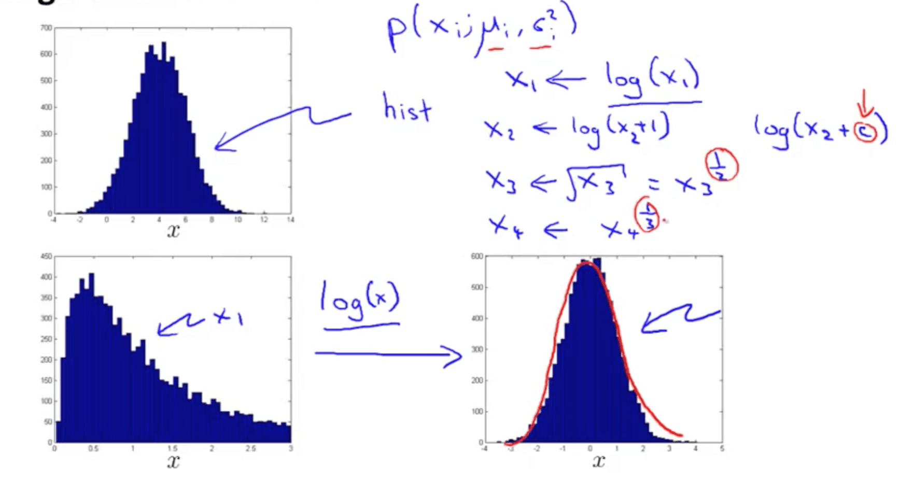
- How do we come up with  features?
    - Error analysis for anomaly detection
        - This allows us to come up with features
        - This is similar to the error analysis procedure that we have for supervised learning, where we would train a complete algorithm, and run the algorithm on a cross validation set, and look at the examples it gets wrong, and see if we can come up with extra features to help the algorithm do better on the examples that it got wrong in the cross-validation set
        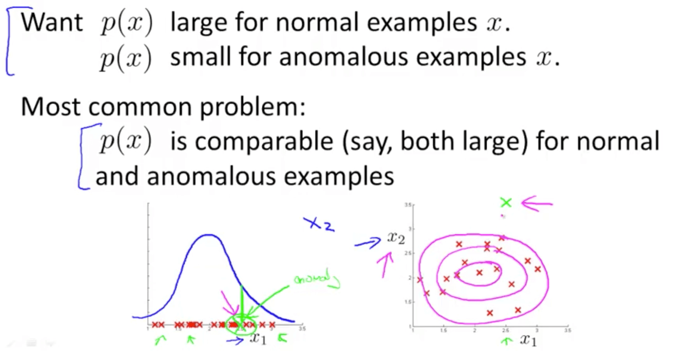
- How do we choose features?
    - Choose features that might take on unusually large or small values in the event of an anomaly
    - Example: monitoring computers in a data center
        - The new feature x5 would take a very large value when there is a huge CPU load but low network traffic
        - This way you can catch anomalies
        

    
## 3. Multivariate Gaussian Distribution

### 3a. Introduction
- Monitoring machines in a data center example
    - The green cross has a pretty high probability
    - The anomaly detection algorithm may not detect this anomaly
    - We have to use a multivariate gaussian (normal) distribution to fix this issue
    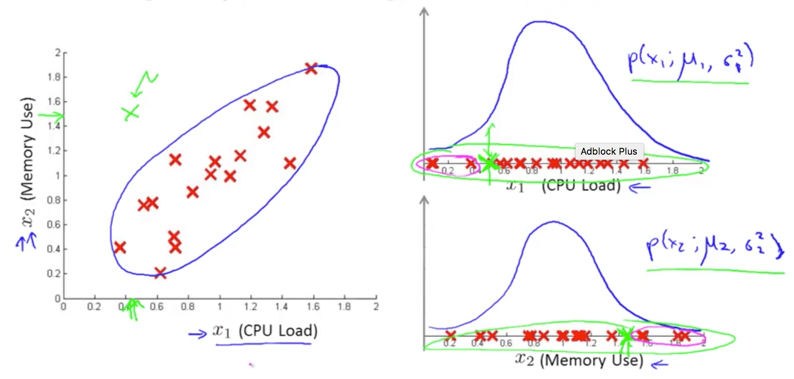
- Multivariate Gaussian (Normal) Distribution
    - Covariance matrix, Σ
        - Varying two elements (diagonal) - variance
            - If you reduce sigma, sharper gaussian
            - If you increase sigma, wider gaussian
            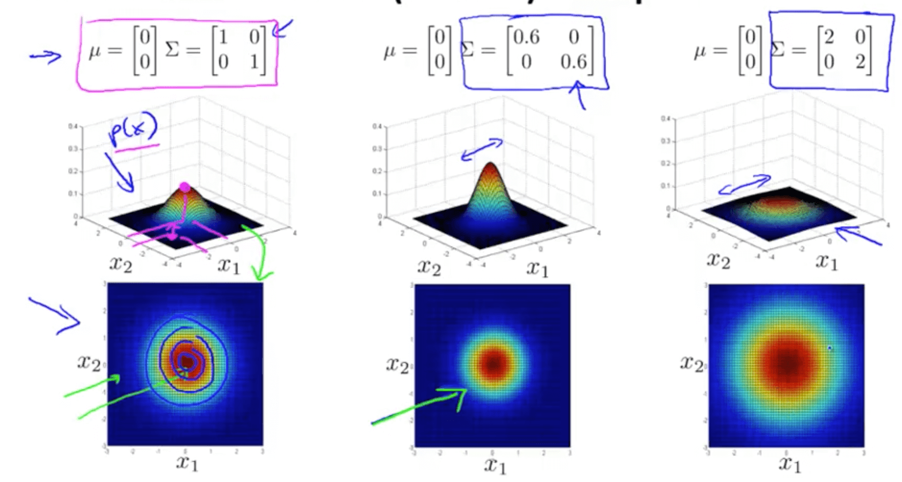
        - Varying one element (diagonal) - variance
            - Reduce variance of x1 and keep variance of x2 constant (middle graph)
            - Increase variance of x1 and keep variance of x2 constant (right graph)
            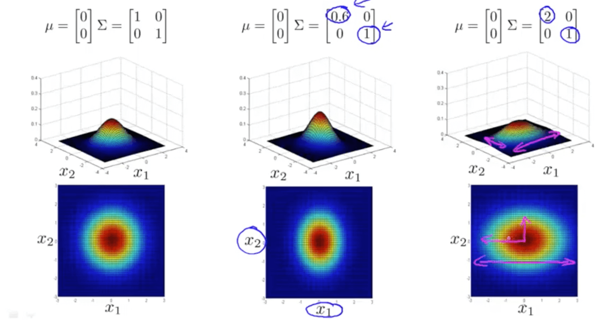
        - Varying two elements (opt diagonal) - correlation
            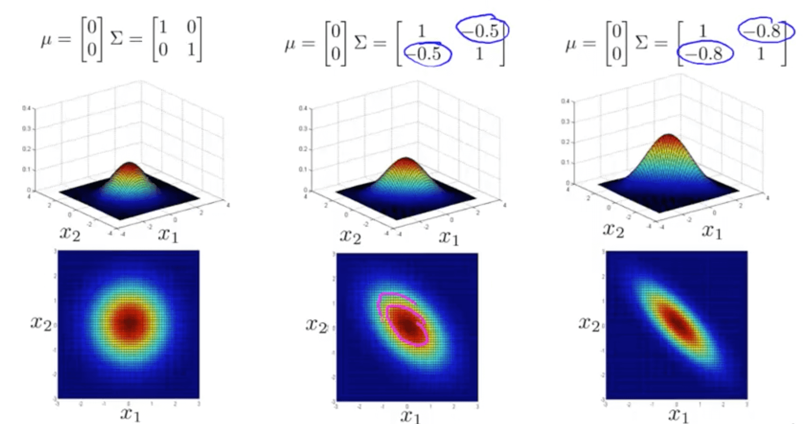
            
    - Mean matrix, μ
        - Varying the μ parameter shifts the center of the distribution
        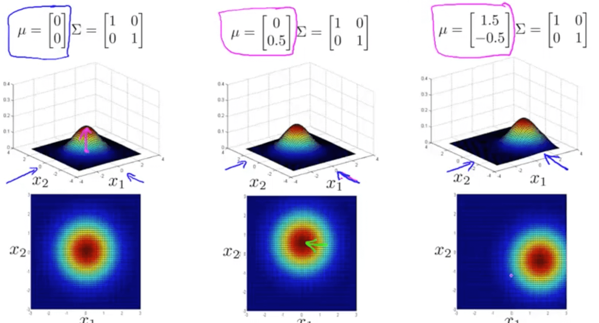

### 3b. Anomaly Detection using Multivariate Gaussian Distribution
- Multivariate gaussian distribution
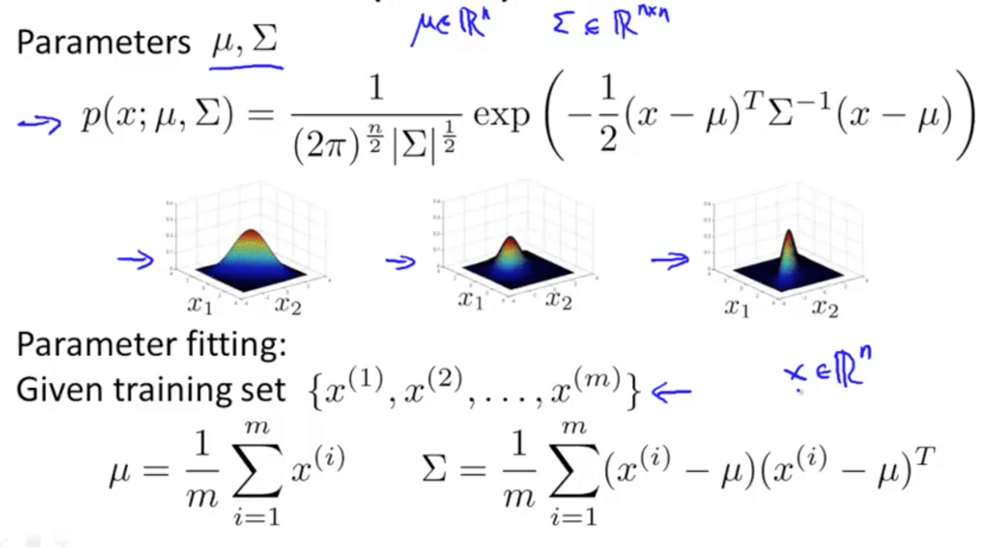
- Anomaly detection algorithm using multivariate gaussian distribution
    - It will flag the green arrow as an anomaly
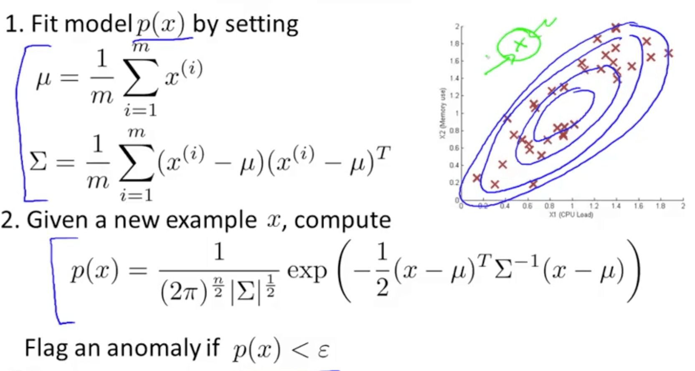
- Relationship with original model
    - The original model is actually a special case of the multivariate gaussian model
    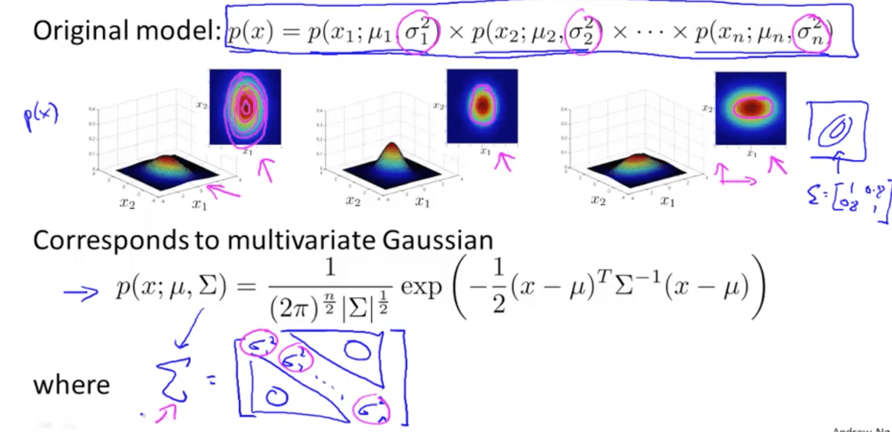
    - Try to get rid features that are linearly dependent and duplicate features for multivariate gaussian model
    

